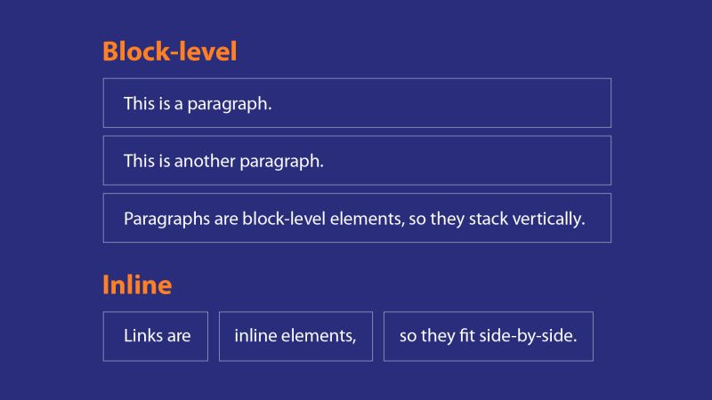
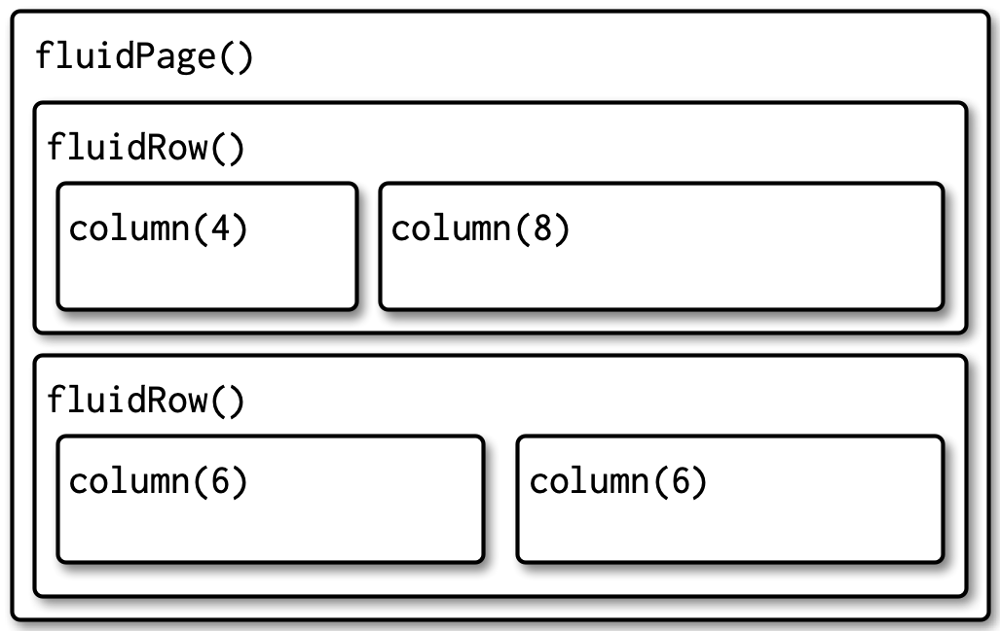
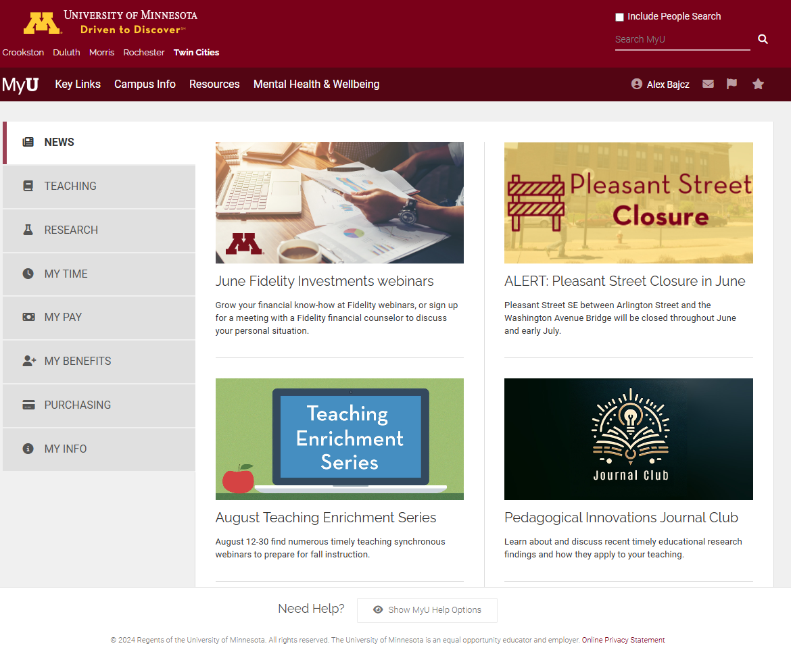
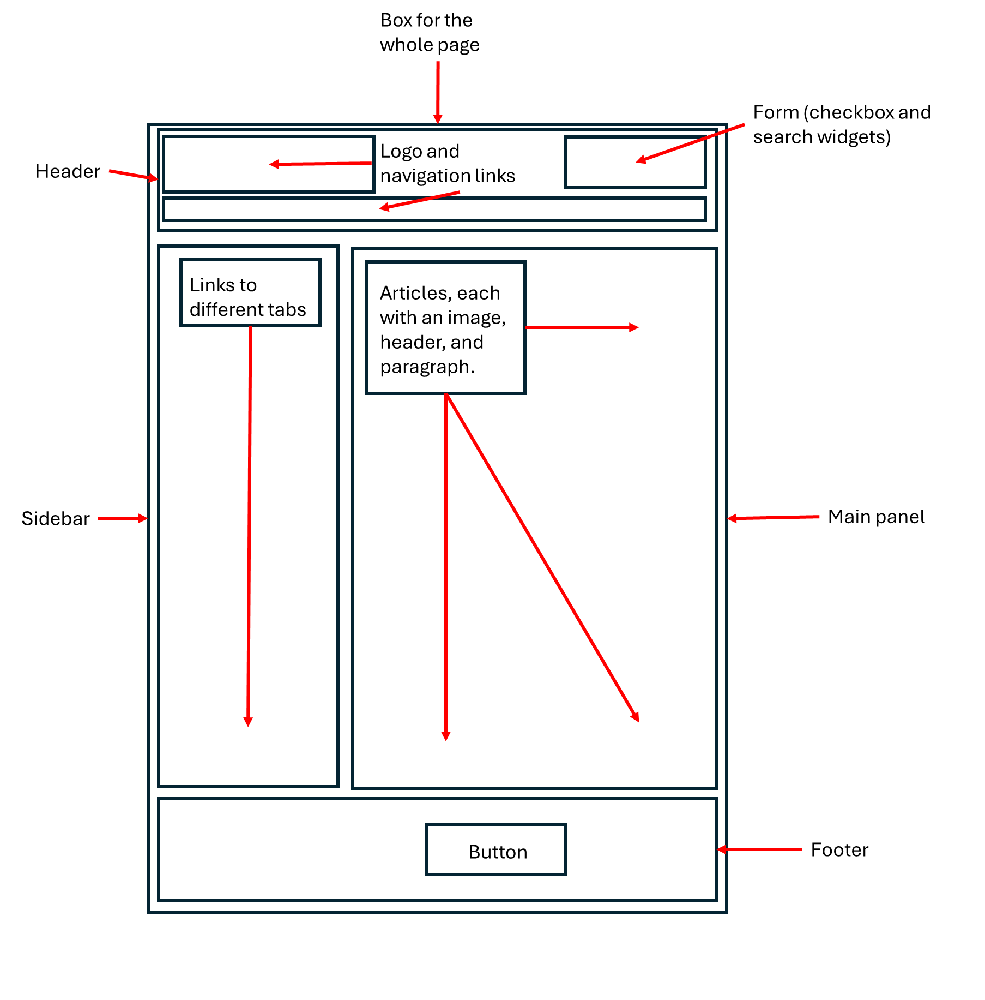

::: objectives
-   Meet the web development languages.
-   Describe how R Shiny relates to other web development frameworks.
-   Picture a typical website's underlying structure.
-   List several typical website components.
-   Establish a working familiarity with HTML and CSS.
:::

::: questions
-   How is a website built?
-   How is building a website using R Shiny similar to/different from
    the "usual" way?
-   What does a website "look like," under the hood?
-   What are the most common website "building blocks?"
:::

**Important**: This course assumes you have working knowledge of the R
programming language and of the RStudio Integrated Development
Environment (IDE). If either is unfamiliar, you could struggle with this
lesson (although the "normal R code" used is *relatively* basic). By
contrast, this course assumes **no** web development experience. If you
have some, this course may be too introductory/simplified to hold your
attention, though you may still find it useful as an overview of the R
Shiny framework.

## The web's languages

R is a **programming language,** *a system with which we direct a
computer to do things for us*.

Just like a human language, R possesses:

-   "Nouns" (**objects** or **variables**),

-   "Verbs" (**functions**),

-   "Punctuation" (**operators** like `<-` and `%>%`),

-   "Questions" (**logical tests** like `x == 1`),

-   "Adjectives" (the **types** and **classes** possessed by
    **objects**) and "adverbs" (optional **parameters** of
    **functions**), and

-   "Grammar/syntax" (**rules** like `1a` being an unacceptable
    **object** name but `a1` being valid).

To have a successful "R conversation," we must form valid "sentences"
(**commands**) in which we create and manipulate nouns, subject them to
verbs, and follow all the rules, just as we would with a human language.

R Shiny, meanwhile, is *not* a programming language**.** Instead, it (in
combination with R) is what a web developer would call a **framework**:
*a suite of tools for building a website*. Specifically, it leverages R
and its conventions/grammar/syntax to accomplish that task as opposed to
using other, comparable tools.

To appreciate how R Shiny is distinct from other frameworks, and to
understand how to use it *well*, we need to understand a few basic
things about "normal" web development:

1.  The *languages* typically used to build websites, what each is for,
    and how each basically works.

2.  The *structure* of a typical website (the "wheres").

3.  The typical *components* (the "whats") of a website.

These will be this lesson's first set of topics.

## How to weave the web

To generalize, a website is typically constructed using several
languages, each specializing in a particular role. The most notable of
these are **HTML**, **CSS**, and **JavaScript** (**JS** for short):

-   **HTML** *structures* a website. It's how web developers specify
    **what** elements a user can see and **where** these go on a page.

-   **CSS** *styles* a website. It's how web developers specify **how**
    each element should **look** (colors, size, borders, fonts, *etc.*).

-   **JavaScript** codes a website's *behaviors*. We'll dissect this
    further later, but a website is in many ways an application that
    runs inside your **browser** (*e.g.*, Edge or Safari). Any changes
    to the website while its open are likely coded in JS.

    -   For example, if a webpage contains a button, and if the button
        disappears when pressed (a shift in the site's HTML), the page
        turns green (a shift in the site's CSS), and some data you
        provided are sent to a database (a shift in the app's
        relationship with the wider internet), JS is likely
        orchestrating all three shifts.

Together, HTML, CSS, and JS are the languages most commonly used to
assemble the "*front end*," "*user interface*," or "*client side*" half
of a website. A website's **user interface** (UI for short) is what a
user sees and interacts with. As far as most users are concerned, the UI
*is* the website. Most assume a website is just that "one thing" and
that the website lives somewhere "out there," on the internet, and we
just use our browsers to visit that "other place."

However, the truth is a *bit* more complicated! First, yes, there is
*always* a second "half" to a website, and, in defense of the average
person's intuition, it is "somewhere else." Somewhere in the world, a
*server* (a computer, basically, but more automated than a personal
computer) acts as a website's **host**, receiving requests for
information and sending that information out to users. A server might
also store private data, such as passwords, or do complex operations
that'd be awkward to have a user's computer do. It also may perform
security checks to ensure users aren't trafficking malware or spam.

For all these purposes and more, websites have "back ends" or "server
sides" that run on a server. Here, the SQL language might be used to
carefully store or read data from large databases, and a whole host of
other programming languages might be used to perform complex operations
and other tasks. These include JS but also PHP, Python, Ruby, and C#,
just to name a few!

When a web developer talks about a framework, they are referring to the
*entire* set of languages/constructs needed to build both halves of a
website. So, for example, HTML + CSS + JS (front end) + PHP + SQL (back
end) is a framework.

Now that we know of the two "halves" of a website, we can consider how a
website *actually* works:

1.  When you "visit" a website by typing its URL into your browser, your
    browser sends a request out to a server for permission to "see the
    website."

2.  The server responds by sending your browser a packet of files (a
    bunch of HTML, CSS, and JS files, perhaps).

3.  These are opened by your browser and deciphered (it's fluent in
    these languages).

4.  Your browser then builds the website you then see and interact with
    per the instructions provided in the files the server sent. The
    website is not "out there somewhere;" it's "alive" and running on
    *your* computer!

5.  When the website needs "further instructions" for how to behave in
    response to your actions or what content to show you next, the
    dialogue with the server continues—new requests are sent, and new
    files are received and deciphered.

::: discussion
Have you ever had to clear your browser's **cache**? What do you think
gets deleted when you do that?

::: solution
A good portion of your cache (in terms of numbers of files, anyway) will
be HTML, CSS, and JS files sent to you by servers to build websites
you've visited! However, there will also be image and video files (which
can be *very* bulky), files for special fonts that website wanted you to
use (perhaps because their logo uses them), and JSON files (text files
that can store data), among others.
:::
:::

#### Where R Shiny sits

When you build a website using R Shiny, you'll write (primarily) two
styles of code:

-   "Normal" R code, and

-   What I'll call "R-like," or "R Shiny" code.

The latter will *look* a lot like R code (that's the point!). However,
it won't *remain* R code. When a Shiny app is compiled, its R Shiny code
is translated into the equivalent HTML, CSS, and JS code so a browser
can decipher it. This means we can use R Shiny and it's "R-like" code to
build the *entire* UI side of a website *without* needing to know much,
if any\*, HTML, CSS, or JS (\*sort of)!

The "normal" R code you'll write, meanwhile, will largely sit within
your website's "back end' (or "server side"), where it may manipulate
data sets, perform operations, generate graphs, etc. You know—typical R
stuff! This means we use R+R Shiny to build the *entire* server side of
a website *without* needing to know much, if any, JS, PHP, Ruby, Python,
SQL, etc!

So, the R + R Shiny framework enables us to build both halves of a fully
interactive, complex website without necessarily knowing *any* other web
development languages or frameworks! In particular, R admirably takes
the place of other, general programming languages typically used for
handling server-side tasks, such as Python or PHP, *especially* when
those tasks revolve around data manipulation, management, or display—R
excels at all things "data!"

::: discussion
Hopefully, you now recognize that websites can be built both with and
without R Shiny. What is *different* about building a website using R
Shiny, then?

::: solution
A few things are different about building a website using R Shiny, but I
think the two most important are:

1.  Whereas writing HTML, CSS, and JS code is often necessary to build a
    website's UI, (deep) knowledge of these languages is **not**
    required to build a website using R Shiny. Instead, you will write R
    code + R Shiny code, and these get "translated" into the equivalent
    HTML, CSS, and JS code for you.\
    \
    Granted, this means you *still* need to learn how to write "R Shiny
    code," and you may or may not find this code all that
    familiar-feeling even though it "looks like" R code. More on that in
    a sec...

2.  Normally, to construct the "back end" of a website, a general
    programming language like PHP or Python is used. These languages are
    quite different from JS, so designing a conventional website often
    requires programming in (at least) two *different* general
    programming languages (*e.g.*, JS and PHP), at least one of which
    you may not have encountered before (JS and PHP are not widely used
    for other purposes).\
    \
    With R Shiny, you can code *both* the front and back ends of a
    website using the "look and feel," at least, of just *one* general
    programming language.
:::
:::

## Let's meet HTML and CSS

I said above that R Shiny ensures you don't *need* to learn HTML and CSS
to build a website. That statement is no lie!

...However, because your R Shiny code must be *translated into* HTML/CSS
code for a browser to understand it, there is a forced similarity
between the two systems—much of the time, you'll *really* be writing
just thinly veiled HTML/CSS code when you're writing "Shiny code." The
latter may *look* "R-like," but it won't always *feel* "R-like" because
of all the ways it will be beholden to these other two languages.

As such, to build a *really* nice Shiny app, and to feel like you know
not just *what* your code is doing but *why* it looks the way it does,
it's helpful to understand the basics of HTML and CSS.

If the prospect of learning *two more* languages is daunting, *don't
panic*! Compared to learning R, learning the basics of HTML and CSS is
*much* easier; these aren't *general* *programming* languages like R.
They have much narrower purposes, so they need a lot fewer "words" and
"rules" to do their jobs than R does. Knowing even a *little* about
these two languages goes a *long* way, I promise!

### HTML 101

We'll start with HTML, since it's a website's foundation. Pretty much
everything an R Shiny developer **really** needs to understand about
HTML falls under four key concepts:

#### Key concept #1: All websites are "boxes within boxes"

At its core, every website is just a box containing one or more
additional boxes, each of which might contain *yet more* boxes, and so
on all the way down. By "box" here, I mean "a container that holds
stuff," not "a rectangle" (though a *lot* of website boxes *are*
rectangles!). *All* HTML does is tell your browser which boxes go inside
which other boxes and what every box contains. Besides other boxes, HTML
boxes can hold text, pictures, links, menus, lists, and much more.

In terms of code, every HTML box looks *something* like this:

``` html
<div id = "my_box">My box's contents</div>
```

Thus, (almost) every HTML box has:

-   An **opening tag** (*e.g.*, `<div...>`), which tells the browser
    where the box "starts."

-   A **closing tag** (*e.g.*, `</div>`), which tells the browser where
    a box "ends."

-   Space for *contents* (here, that's the text `My box's contents`),
    found between the opening tag's `>` and the closing tag's `<`.

-   Space inside the opening tag for *attributes*, which are
    **adjectives** that make a box "special."

    -   Here, we gave our box a unique `id`, `"my_box"`, using
        `attribute = "value"` format.

In R Shiny, you can build the exact same box using its "R-like code:"

``` r
div(id = "my box",
    "My box's contents")
```

Here, we've replaced HTML's **tag notation** involving `<>`s with R's
**function notation** and its `( )`s, and we specify attributes and box
contents using R's traditional **function arguments** instead.

Importantly, as I said above, one thing every HTML box can contain is
one or more additional HTML boxes. In fact, most websites contain nested
layers of boxes, each with their own unique properties, that go many,
many layers deep:

```{r, eval = F}
div(id = "my box",
    div(id = "layer2", 
        div(id = "layer3", ...)))
```

It's through this nesting of boxes that the complex visual structure of
a typical website is born.

::: exercise
Below is some HTML code containing some (nested) HTML boxes. Rewrite the
code below in R Shiny UI code instead using the `div()` function:

``` HTML
<div id="main-container" class="container">
<div class="content">Welcome to our app!</div>
</div>
```

::: solution
The above code contains one outer HTML box with both an `id` attribute
and a `class` attribute. R Shiny has equivalent **function parameters**
for those two attributes in its `div()` function:

```{r shiny divs, eval=F}
div(id = "main-container",
    class = "container",
    #...contents go here.
    )
```

In this example, this outer `div`'s contents are another `div`, which
itself has a class and some text contents:

```{r shiny divs2, eval=F}
div(id = "main-container",
    class = "container",
    div(class = "content",
        "Welcome to our app!") #Text strings need to be quoted in R even though they don't in HTML.
    )
```

While nesting many function calls inside one another is not an uncommon
practice among everyday R users, it's certainly not universal, but it's
essential to coding in HTML, so some find the amount of nesting found in
R Shiny UI code to be unfamiliar.
:::
:::

#### Key concept #2: Websites have heads and bodies

To oversimplify, every website is an HTML box (`<HTML>...</HTML>`)
containing two smaller boxes: a "head" (`<head>...</head>`) and a "body"
(`<body>...</body>`).

The head's contents are (mostly) invisible to users; the head contains
instructions for *how* the browser should construct the website. The
body box, meanwhile, contains everything the user can see and interact
with.

In R Shiny, we don't need to build the HTML, head, or body boxes—those
are made for us. Instead, we'd spend most of our time specifying only
the stuff that goes inside the body box.

However, we can (and sometimes need to) put things in the head box to
provide our users' browsers with more guidance. This is done using the R
Shiny `tags$head()` function:

``` r
tags$head(#Instructions for the user's browser go here...)
```

#### Key concept #3: HTML boxes are either inline or block

Broadly, there are two kinds of HTML boxes: **inline** and **block**.
The difference is how each is displayed when a website is built.

A **block element** takes up the *entire* horizontal "row" it is placed
on. In other words, it'll occupy the *entire* width of the browser
window (if allowed), and it'll force the next item to go *below* rather
than *next* to it, as though the browser was forced to hit the "Enter"
key.

For example, the `<p>...</p>` element (created in Shiny using the `p()`
R Shiny function) creates "paragraph" boxes (or, more accurately, boxes
for text blocks, which can any amount of text). If you put several
consecutive paragraph boxes inside your body box, they would display in
a column, with the first at the top and the last at the bottom, and each
would occupy the full width of the box that contains them:



**Inline elements**, meanwhile, only take up as much horizontal space as
they have to (by default) to accommodate their contents' size, and thus
they go next to each other on the same line (if there's room); they
don't *force* new lines.

For example, the `<a>...</a>` element (made in R using the `a()` R Shiny
function) is a box that holds a link to a URL or file. You could use
several such boxes within a single paragraph box *without* spawning a
new line after each one.

``` HTML
<!-- HERE'S HOW YOU'D RECREATE THE IMAGE ABOVE IN HTML -->
<div>
<h1>Block-level</h1>
<p>This is a paragraph.</p>
<p>This is another paragraph.</p>
<p>Paragraphs are block elements, so they stack vertically.</p>
<h1>Inline</h1>
<a>Links are</a>
<a>Inline elements,</a>
<a>so they fit side-by-side.</a>
</div>
```

```{r equivalent html, eval=F}
#And here's the exact same code, only written in R Shiny code instead:
div(
  h1("Block-level"),
  p("This is a paragraph."),
  p("This is another paragraph."),
  p("Paragraphs are block elements, so they stack vertically."),
  h1("Inline"),
  a("Links are"),
  a("Inline elements,"),
  a("so they fit side-by-side")
)

#Note that text contents are quoted. Note also that commas separate every UI element from the next. 

#Lastly, note that the line breaks between elements here (and in the HTML code above) are irrelevant with respect to the code's effects--paragraph and heading boxes would still stack vertically without them, and links still will fit side-by-side with them.
```

This dichotomy means every element of every website falls into one of
two aesthetic camps. Certain elements tend to "stand alone" or "stand
apart" from others visually and logically, such as headings and
navigation bars. These are generally block elements. Other elements "fit
together" and "co-mingle," such as links and images. These are generally
inline elements.

#### Key concept #4: The Flow

These days, a user might view your website on a very *wide* screen (like
that of a projector) or a very *narrow* screen (like that of a cell
phone in portrait mode, or even the screen of a smart watch!).

If your website has, say, five elements, it may not make sense to
*arrange* those elements the same way on a narrow screen as on a wide
screen, just as you probably wouldn't arrange the same furniture in a
tiny room the same as you would in a huge room.

Careless arrangement of elements is often *obvious* to even casual web
surfers. On narrow screens, elements that are too big might "spill" out
of the containers meant to hold them, and when too many elements are
stacked side by side, tedious scroll bars may be the only way to see
elements that are otherwise obviously extending "off-screen."

On wide screens, meanwhile, small elements (especially small block
elements) may look silly without constraints, such as when a single
sentence spans the entire width of the screen. As another example, font
sizes that feel appropriate on a small screen might be far too big or
small when viewed on a computer monitor.

It's hard *enough* to craft *one* great website—it'd be a *nightmare* to
design a different-looking website for *every* *possible* screen size
your users might have!

Thankfully, then, most websites are designed to follow some paradigm of
"flow." This means they'll semi-automatically reorganize their contents
according to the size of the user's screen. For example:

-   Elements that sit side by side on a wide screen shift to stack
    vertically.

-   Elements (such as images) that might be permitted to stay large for
    wide screens may shrink to fit comfortably inside their boxes on
    narrow screens.

-   Some elements may "teleport" to new locations on the page as a
    screen narrows such that, if all elements are arranged vertically,
    their order is more logical to a user encountering them in that way.

::: challenge
Try it: Go to
[dictionary.com](www.dictionary.com "A link to dictionary.com, a good site for demonstrating the HTML concept of the "flow."")
and vary the width of your browser window by pulling its edges inward.
How does this website "flow?"

::: solution
For me, I saw a number of changes as I shrunk my browser screen: The
menu at the top became a collapsed "hamburger" menu (a button with three
lines that opens to reveal options), the links section slid below the
search bar, the word of the day box shrank to take up less room, and the
games sidebar teleported to much further down on the page. You may have
noticed many other changes!
:::
:::

In line with this, R Shiny comes with custom boxes that are "fluid,"
meaning their size is flexible and changes automatically to fit the size
of their contents. Like inline elements, these boxes will only take up
as much space as necessary. However, their contents will also
automatically stack vertically if the screen becomes too narrow, sort of
like block elements. Additionally, these boxes includes ones that will
divide a space into a table of "rows" and "columns" so that elements can
be arranged in a grid-like fashion whenever the screen is wide enough to
accommodate it:



The first step of building a great Shiny app is to plot out your app's
*layout*. What elements should exist, and where should they go? How big
does each need to be? What kinds of devices will your users be on? How
will elements be nested to achieve a pleasing "flow" of elements, no
matter the device your user is using? It's important to remember that
your app may not be able to look the exact same for every user and to
design it with that in mind!

### CSS 101

If HTML tells a browser **what** to display and **where** to display it,
then CSS tells a browser **how** to display things.

Compared to HTML, CSS is even easier to learn (at least, that's my
opinion!). CSS code consists of functional units called **rules**. Each
rule consists of a **selector** and a list of one or more
**property-value** pairs:

-   The **selector** tells the browser which box(es) to adjust the
    appearance of.

-   The **properties** tell the browser which characteristics of those
    boxes to change.

-   The **values** tell the browser the new values to set for each of
    those characteristics.

Here is an example **CSS rule**:

``` css
p.intro, div#firstintro {
font-style: italic;
font-size: large;
} 
```

On the first line prior to the opening brace, `{`, we have our
**selector**, which here is targeting two different groups of boxes
simultaneously, with those two targets separated with a comma:

1.  The first target is paragraph boxes (`p()`s), but *only* those with
    the `intro` **class** **attribute**. A **class** is actually an HTML
    ***attribute*** that allows many boxes to be controlled and styled
    as one group. A period connects an HTML element type with a
    **class** name in a CSS selector (*e.g.*, `p.intro`).

2.  Our second target is `div`s (a highly generic HTML box), but *only*
    the one with the **id** **attribute** of `firstintro`. `id`s allow
    us to control or style just a specific element. A hashtag connects
    an HTML element type with an `id` name in a CSS selector (*e.g.*,
    `div#firstintro`).

    -   To target *all* elements of a type (*e.g.*, all `div()`s), write
        only the element name without any periods or hashtags (*e.g.*,
        `div`)

    -   If multiple different element types (such as `div`s and `p`s)
        have the same class, you can omit an element type and just
        specify the class to target all those elements with the same CSS
        rule (*e.g.*, `.intro`).

Inside of our rule's braces, meanwhile, we have a list. Each list item
is a **property name** (*e.g.*, `font-style`) and a new **value**
(*e.g.*, `italic`) to set for that property. These are separated with a
colon and end with a semi-colon. If you get the punctuation or spelling
of a CSS rule wrong (easy to do!), it won't do anything, so mind the
rules carefully!

CSS rules get more complex than this one, but they can be simpler than
this one too, so if this rule makes sense to you, you're in great shape!

::: challenge
Try it: W3Schools is a *fantastic* resource for learning HTML and CSS.
[Go to their CSS page and check out some of the tutorial pages on the
left-hand
side.](https://www.w3schools.com/css/default.asp "W3Schools is a great resource for learning HTML and CSS; check out their CSS tutorial")

Using the "CSS Text" tutorial, write a CSS rule that would change the
font color of all paragraph boxes to red and make all their text be
center-aligned.

::: solution
Here's how you'd write this rule:

``` css
p {
color: red;
text-align: center;
}
```

Notice that we can target *all* `p` elements by not appending any
classes or ids. Don't forget your colons, braces, commas (if needed), or
semi-colons! Also, notice that, unlike in R, text values in CSS (like
"red" and "center") *aren't* **quoted**.
:::
:::

If you're thinking "This sounds complicated/tedious/off-topic! Why are
we bothering to learn any CSS, when R is going to translate my Shiny
code to CSS for me??"

That's a good and fair question! The truth is that, unfortunately,
understanding CSS to some degree is still **essential** for crafting an
*attractive* R Shiny app. Without specifying your own CSS, you'll need
to:

1.  Accept the *very* basic styling employed by R Shiny by default, or

2.  Use generic-looking themes available from packages like `bslib` that
    might leave your app looking like "every other website" in ways that
    can be difficult to customize.

Don't get me wrong—these are perfectly acceptable options *if* your apps
are simple or have limited user bases that may be indifferent to looks.
However, in my experience, even in those instances, neither option is
*nearly* as satisfying as learning to style your app yourself, even if
you're not a design whiz!

So, while we won't pause to style our app much in this series of
lessons, we will do so occasionally so that you can see the difference
it makes.

## Nothing is new on the web

We've talked about how a website is built, and we've looked at the
specific roles played by HTML and CSS in that process. In particular,
we've discussed the concept of HTML boxes and how a website is just a
series of these boxes, stacked next to, below, and inside each other.
Then, we've seen that the style of those boxes and their contents can be
customized using CSS.

But what typically goes ***inside*** all those boxes, besides other
boxes?!

With the internet now over 30 years old, most people have been
interacting with the web a *long time*! We've developed collective
expectations for how websites should look and feel as a result and, as
such, most websites contain a set of immediately-recognizable
components, including:

-   A **header** (a box permanently hooked to the top of the screen/page
    or to the top of a page section). This could contain other elements
    like a title, a logo, a navigation menu, *etc.*

-   A **footer** (similar to a header but at the bottom of a
    screen/page/section). This might contain elements such as text boxes
    for contact info or legal information, links, disclaimers, version
    information, *etc.*

-   A "main content area," which might be a single rectangle or multiple
    rectangles of (un)equal size (such as a smaller "sidebar" and a
    larger "main panel"). This area may contain blocks of text, media
    such as videos, articles, graphics, *etc.*

-   Text blocks, which might themselves contain paragraph blocks, links,
    quotes, code, articles, lists, headings, etc.

-   **Forms** containing information-gathering **widgets**—elements
    users interact with to provide the page with information or
    direction, such as drop-down menus or sliders.

-   **Modals** (which you may know as "pop-ups"), which partially or
    wholly obscure the webpage and may contain additional information,
    options, or alerts.

-   Background tiles, which may hold images or instead be solid colors,
    gradients, or patterns.

-   Navigation systems, such as buttons, scroll bars, or drop-down
    menus, that allow users to move around a site.

All these elements (and more!) can be added to the websites designed
using R Shiny. As such, some of the first, and most important, decisions
you'll make when building a Shiny app are deciding:

1.  *What* elements your app will contain,

2.  *Where* they will go, and

3.  What they'll enable a user to *do*.

While the list above is not exhaustive, it should help you begin to make
those decisions.

::: challenge
Consider the webpage below:



Like all webpages, this one is just a series of "boxes inside of other
boxes." Draw an abstracted version of this site as only a set of nested
boxes. Label each box based on what it seems designed to hold (don't
bother drawing *every* box, just the "major" ones).

As you do, list the different components housed in these boxes you
recognize (buttons, text blocks, etc.).

::: solution
Here's what I noticed and identified:



You may have noticed more, fewer, or different things—that's ok!
:::
:::

::: keypoints
-   Classically, websites are built using HTML, CSS, and JavaScript to
    construct the "client side" of the site, which runs in a user's
    browser on their local computer, and by using SQL plus a general
    programming language like Python to construct the "server side" of
    the website, which runs remotely on a server that communicates back
    and forth with the user's browser to ensure the site is constructed
    and displayed to the user as intended.
-   R Shiny allows you to build a website using just R + R Shiny code,
    such that deep understanding of other web development languages like
    PHP and JavaScript is not required.
-   However, some familiarity with HTML and CSS is practically essential
    to build a great app and to really understand what you are doing
    when writing "R Shiny" code.
-   That's ok—HTML and CSS are very approachable languages compared to
    general programming languages like R.
-   HTML tells a browser what to put where when building a website.
    Websites are just "HTML boxes holding stuff and/or other boxes."
    Some boxes force new lines after them; others don't. How boxes will
    "flow" on wide versus narrow screens is an important design
    consideration.
-   CSS tells a browser how to display each element on a website. It
    consists of **rules** targeting specific HTML boxes that specify new
    **values** for those boxes' aesthetic **properties**.
-   Website design has matured such that most websites look and feel
    broadly similar and share many elements, such as buttons, links,
    **widgets**, articles, media, and so on. R Shiny lets us add these
    same elements to our apps.
:::
