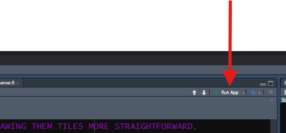

::: objectives
-   Build out the files and folders needed to house your app.
-   Learn the names to use for these files and folders.
-   Value the convenience of a `global.R` file.
-   Link an external stylesheet to your app.
-   Structure your `ui.R` file by nesting Shiny HTML boxes.
-   Open your browser's developer tools dashboard to examine your app's
    HTML and CSS code.
:::

::: questions
-   How should I start to build a Shiny app?
-   What code's required to get a Shiny app to start?
-   What goes in my `server.R` file? My `ui.R` file? My `global.R` file?
-   How do I design an app that will look and nicely on any device?
:::

### Preface

In the previous lesson, we learned the basics of web development and how
R Shiny relates to other web development **frameworks**. In the next
lesson, we'll start building a Shiny app together. First, though, there
are several steps we should take to set ourselves up for success.

### Installing packages

We'll use a number of add-on R **packages** in our app. If you haven't
already, install those now:

```{r installing packages, eval=FALSE}
##RUN THIS CODE IN YOUR CONSOLE PANE--**DON'T** INCLUDE IT INSIDE YOUR SHINY FILES. YOU ONLY NEED TO INSTALL PACKAGES **ONCE EVER**.
install.packages("shiny", "dplyr", "ggplot2", "leaflet", "DT", "plotly", "gapminder", "countrycode", "sf")
```

Note that `dplyr` and `ggplot2` are part of the `tidyverse`, which can
be installed using `install.packages('tidyverse')`. However, that
installation can take awhile, and we won't use other `tidyverse`
packages, so it's faster to install just the two packages above *a la
carte*.

We need to turn all these packages on in order to access their features,
but we need to do some more set up first.

## Establishing our Shiny app's Project Folder

It's useful to make a single folder (we'll call it our "**root
directory**" or **root** for short) to house all our app's files and
then to make that folder an **R Project folder**. You don't need to know
what all that means if you don't already; just know it's valuable.

Here's how you do it:

1.  In RStudio, go to `File`, then select the second option,
    `New Project`.

2.  In the pop-up that appears, select the first option,
    `New Directory`.

3.  Next, we'll select the type of project we're creating. One of the
    options you'll be presented says `Shiny application`, but *don't*
    pick that one. Select the *first* option, `New Project`, *instead*.

4.  On the next screen, use the `Browse` button to find a location on
    your computer in which to place your project folder. Then, give the
    project some name related to the app you're building. There are some
    other options here that, if you're familiar with Git or `renv`, you
    might consider. Otherwise, click `Create Project`.

**Important**: Once the Project is created, you will see a `.Rproj` file
appear inside the new folder. From now on, to work on your Shiny app,
launch this file to start an RStudio session connected to your Project.
Doing so will save you time and energy!

## Creating the necessary files

It's my recommendation that you build Shiny apps using the so-called
three-file system:

-   Go to `File`, select `New File`, then select `R Script`. Repeat this
    process two more times to create three **script** files in total.

-   Then, give them these *exact* names (all lowercase):

    -   `ui.R`

    -   `server.R`

    -   `global.R`

These files will hold our app's client side (**user interface**) code,
back-end (**server**) code, and setup code, respectively.

R Shiny will recognize these exact names as "special," so using them
enables some handy features. One of these is that, in the top-right
corner of the Script Pane, you should see a "Run App" button with a
green play arrow whenever you are viewing any of these three files in
this Pane.



This button will allow you to start your app at any time to check it out
or to test it (something you will want to do *constantly*, both during
this workshop and when developing a real app!).

There are some other folders and files we should create next:

-   In the "Files, Plots, Packages, etc." Pane in your RStudio window,
    while viewing your Project Folder, click the `New Folder` button.
    Name the new folder *exactly* `www`. R Shiny will automatically look
    inside a folder by this name for many things, including media files
    (like images), custom font files, and CSS files referenced by your
    app.

    -   Speaking of which: Click `File`, `New File`, then `CSS file`.
        Give this new file the name `styles.css`, then save it in your
        new `www` folder. This is the file in which we'll put custom CSS
        code to style our app's aesthetics.

    -   If you plan to build complex Shiny apps, you *may* also want to
        create a file for custom JavaScript code called `behaviors.js`
        and place this new file in your `www` folder as well. We won't
        use any such file in this workshop, but because there is more
        you can do with JS than R Shiny will do for you, there are many
        instances where a *little* custom JS code can *significantly*
        enhance your app's behaviors.

-   Next, create a second new folder inside your Project Folder. Call
    this folder `inputs`. Use this folder to store input files your app
    needs to start up, like data sets, but that *aren't* media like
    pictures or fonts. We won't use this sub-folder, but, for real
    projects, it useful to organize your files in this way.

-   Similarly, create a third new folder inside your Project Folder.
    Call it `Rcode`. As an app's code base gets larger, if you ever want
    to divide your app's code into smaller chunks (such as by building
    custom functions to perform repeated tasks or by dividing your app
    into "modules"), you can place R files for each chunk in this
    folder, then source those files inside your `global.R` file. We
    won't use any such sub-folder, but I use one for all my apps.

We now have all the files and folders we need, so we can start placing
into each one the code needed to get a Shiny app to start.

### Starting our global.R file

We'll start with `global.R`. R will run this file first when booting up
your app, so it's job is to load and/or build everything needed to
enable the rest of the app to start up successfully.

When your app gets large and complex, this file will hold many different
things but, at a minimum, it will contain two things to start: 1)
`library()` calls to load required packages and 2) `read*()` calls to
load required data sets:

```{r Setting up global, eval=F}
##Place this code in your global.R file!

### LOAD PACKAGES <--CREATE HEADERS IN YOUR FILES TO KEEP LIKE CODE TOGETHER AND TO STAY ORGANIZED!
library(shiny)
library(dplyr)
library(ggplot2)
library(plotly)
library(DT)
library(leaflet)
library(gapminder)
library(sf)
library(countrycode)

### LOAD DATA SETS 
gap = gapminder
#THESE TWO LINES WILL HELP US LATER.
gap$country = as.character(gap$country)
gap$continent = as.character(gap$continent)
```

By having a `global.R` file, we can place things like `library()` calls
and code for loading data sets in a single place and have it work for
the entire app. Without it, we'd need to place these commands inside
*every* app file in which they are needed—what a pain!

## Starting our server.R file

Setting up `server.R` is *relatively* easy because there's only one
block of code we need to place in it at the start:

```{r setting up server, eval = F}
##Place this code in your server.R file!

server = function(input, output, session) {
  
  #ALL OUR EVENTUAL SERVER-SIDE CODE WILL GO HERE.
  
}
```

Notice: `server.R` will eventually hold just one **object**: a
**function** called *exactly* `server`. This function will have three
**parameters** called *exactly* `input`, `output`, and `session`. R
Shiny will look for the function by this name when it starts up an app,
and it will create objects called `input`, `output`, and `session` to
feed to it during the start-up process. Using these *exact* names is
mandatory!

It makes sense, if you think about it, that our app's server file will
create a **function** (a verb) because it's the "half" of the app that
will *do stuff*. By contrast, the **UI** of our app just *"sits there
and looks pretty"* and only changes when directed to do so by the
server.

## Starting our ui.R file

Even less code is *needed* to start with in `ui.R` because our app's UI
file does not produce a function but rather just a single HTML box into
which other boxes will eventually be placed:

```{r setting up UI, eval = F}
##Place this code in your ui.R file!

ui = fluidPage(
  
  #ALL OUR EVENTUAL CLIENT-SIDE CODE WILL GO INTO ONE OF THE TWO SECTIONS BELOW.
  
  ### HEAD SECTION
  
  
  ### BODY SECTION
  
)
```

Here, we use an R Shiny HTML box called `fluidPage()` to create a
stretchy box that will hold the entirety of the website we'll build.
We'll soon fill this box with a bunch more boxes to give our app more
structure.

However, first, let's load our app's **stylesheet**, the `styles.css`
file made earlier. Because the UI is the "visual" part of a website, and
because CSS controls a website's looks, it makes sense we'd load a CSS
file in `ui.R` instead of in `global.R` or somewhere else. It also makes
sense we'd put this linkage in our app's `head` HTML box because it's
instructions, not something a user needs to see.

Here's how to do this:

```{r loading CSS file, eval=F}
##Place this code INSIDE your app's fluidPage container in the HEAD sub-section!
tags$head(
  
  tags$link(href = "styles.css", 
            rel = "stylesheet") 
), #<--YOU'LL NEED A COMMA TO SEPARATE EVERY NEW ELEMENT IN YOUR UI FROM THE PREVIOUS ONE, SO YOU WILL SOON NEED A COMMA HERE WHETHER YOU ADD IT NOW OR NOT.
```

Here, we've told the app there is a specific *stylesheet*, a CSS file,
by the name of `styles.css` we want a user's browser to be sent so that
it can be used when constructing our website. Note that we *link* to
this file rather than *load* it—that's an HTML thing!

*By default, the app will look for CSS stylesheets in the `www`
sub-folder*, so as long as that's where we put it, we don't need to
provide a more complex file path to the `href` parameter.

Now, we can add some additional boxes to our `fluidPage()` to start
giving our app some structure. In this workshop, we'll *sort of*
practice an approach called **mobile-first design**. This means
designing apps with mobile users in mind first and all other users
second.

The logic of this approach is that, if an app looks and feels good on a
narrow-screened, mouseless mobile device, it should feel and look at
least as good on a wider, mouse-enabled device, whereas ensuring things
work as well in the opposite direction is harder.

This means, among other things, we'll place our UI elements assuming
they will take on a "vertical" or "stacked" layout for all our mobile
users, one in which pretty much every major element gets the screen's
full width to occupy, and each subsequent element goes below rather than
next to the previous one.

However, we'll set things up such that, if a user does have a wider
screen, *some* things will automatically arrange side by side instead,
if there's room. This arrangement will look better on a computer
monitor, which is generally much wider than it is tall, because more
content will fit on the screen at once and the added spatial constraints
will keep elements from stretching out horizontally too much.

So, let's add the following to our app's UI:

1.  A **header**, built using `h1()` with the `id` of `"header"` (this
    is a first-level header).

2.  A **footer**, built using `div()` with the `id` of `"footer"`.

3.  In between, let's make a `fluidRow()` using the R Shiny function of
    the same name. Inside it, let's place two columns using `column()`
    to create two "cells" in a small, 1 row by 2 column "table."

The R Shiny function `column()` has a required input, `width`. All
`width` values of `column()`s inside a given `fluidRow()` must be whole
numbers that sum to 12.

So, let's set the `width`s of these columns to `4` and `8`,
respectively. In practice, this'll make the second column twice as wide
as the first. As a result, the second column will take up 2/3rds of the
available screen width, creating the *feel* of a left-hand "side panel"
and a right-hand "main panel."

However, as we've discussed, `fluidRow()`s are "smart"—on narrow
screens, elements in the same row will flow vertically if there's not
enough room for all of them to fit side-by-side. This means that our
"side panel" will actually go *above* our main panel on a cell phone
screen automatically (because it's specified *first*):

```{r adding some layout elements, eval = F}
##Place this code INSIDE your app's fluidPage container in the BODY section!

h1("Our amazing Shiny app!",
         id = "header"), #<--EVERY NEW UI ELEMENT IS SEPARATED FROM EVERY OTHER BY COMMAS.

fluidRow(
  ###SIDEBAR CELL
  column(width = 4),
  ###MAIN PANEL CELL
  column(width = 8)
),

div(id = "footer")
```

A couple more things to note about R Shiny boxes from this example:

1.  Most Shiny boxes have a `class` parameter and an `id` parameter.
    These two parameters are always optional, and their purpose is to be
    used as `id`s in CSS selectors.

2.  However, if a box has an `inputId` or `outputId` parameter, those
    are *mandatory* because those serve Shiny-specific purposes (in
    addition to serving as CSS `id`s)—more on these in the next lesson!

3.  Every Shiny UI element is separated from every other using commas,
    much as separate items are distinguished in R code in many other
    contexts. Forgetting these commas is a *very* common mistake for
    Shiny beginners!

4.  Because R Shiny UI code is *really* just HTML code, writing it
    involves **nesting** a lot of function calls inside other function
    calls. For many, this can be confusing initially! Keep your code
    organized by using lots of comments to divide your UI into
    sub-sections if that helps you.

::: discussion
Start up your app at this point. What do you see? Explain why the app
looks the way it does so far.

::: solution
Besides our title, our app will actually look completely empty!


This is because we have made several HTML boxes (a footer, a side panel,
a main panel, and a box holding the latter two), but we haven't actually
put anything in those boxes yet!

That is to say that HTML boxes are empty until we provide them with
contents that *aren't* other HTML boxes. That's what we will do in the
next lesson!
:::
:::

By most standards, our app also looks very basic—just a white screen
with a bland-looking title. This is because the default CSS applied to
Shiny apps is *very* basic! This is why I argued that learning some CSS
is essential to crafting attractive Shiny apps.

Sure, we've linked to a separate CSS stylesheet, but we haven't actually
put any code in it yet. Until we do, the default, bland style rules will
be used.

::: exercise
Let's make our first attempt to style our app! Since there's nothing
else to style yet, let's style our title. In your `styles.css` file,
write a **rule** that will make the title of our app green and bold.

The first **property** to set here is called `font-weight` and the new
value we want for this property is `bold`. The second property-value
pairing you should already more or less know! Run your app to make sure
your rule is working.

::: solution
Here's what our CSS rule should look like:

``` css
h1#header {
font-weight: bold;
color: green;
}
/* You could also have simply put #header in the selector. 
```

And this is what our app should look like once you apply the change:


:::
:::

## Meeting the Developer Tools dashboard

Here, we gave our header a specific `id`, which made it easier to target
with our CSS selector. But, in either case, how could you have found out
the right selector to use, if you weren't sure?

Good question: Let's introduce you to the web developer's secret
weapon—your browser's **developer tools**.

I use Microsoft Edge as my browser. To access my developer's tools, I
right-click any element on any website and select the last option in the
resulting menu, which says `Inspect`.


[The exact option you might need to select might be
different](https://jeffrey1183.gitbooks.io/intro-to-programming/content/front-end-development/what-is-javascript/4developer-tools-on-different-browsers.html).

Once you figure out how to open up your browser's developer tools,
you'll see that it's a frankly intimidating window that shows, among
other things, the HTML of the website you're on (usually on the top or
left) and the CSS of the element you're inspecting (usually on the
bottom or right):


If I didn't know the right selector to use, I could right-click on our
title header element in the HTML (see picture above), go to `Copy` in
the resulting menu, and then select `Copy selector` from the resulting
sub-menu:


Doing this would put `#header` into your clipboard, in this case.

This is just one of the many ways that the developer tools dashboard is
a useful tool for web development. We won't cover it any further in this
workshop, but it's essential you know how to access it, especially for
troubleshooting!

::: keypoints
-   Use the three-file system to organize your app's code to benefit
    from several R Shiny features built into RStudio.
-   A `global.R` file is handy for storing all code needed to fuel your
    app's start-up as well as code that needs to run only once.
-   A CSS stylesheet for dictating your app's aesthetics can be linked
    to an app inside of `ui.R`, specifically using `tags$head()` to put
    the linkage into our app's head container.
-   UI elements get nested inside one another and must all be placed
    inside the UI's outermost container (here, a `fluidPage()`). Most UI
    elements can be given `id`s and `class`es for styling with CSS. UI
    elements must be separated from one another with commas.
-   `fluidRow()` and `column()` can be used to create a "grid," within
    which elements could be arranged next to each other on wide screens
    but which will automatically flow vertically on narrow screens,
    creating a responsive, mobile-first design with little fuss.
-   CSS styling requires knowing the right selector to use to target the
    right element(s). If you aren't sure of the right selector to use,
    you can retrieve it using your browser's developer tools dashboard.
:::
