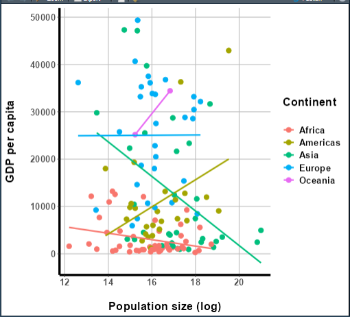

::: objectives
-   Name the essential functions of the `DT`, `leaflet` and `plotly`
    packages.
-   Experiment with the standard interactive features of the
    plots/tables/maps produced by these packages, and recognize how to
    disable them.
-   Customize the look and feel of these graphics.
-   Update complex interactive graphics instead of remaking them using
    **proxies**.
-   Recognize some events a user might trigger on these complex
    interactive graphics and how to watch for them.
:::

::: questions
-   How do I add an interactive map/table/graph to my app?
-   What features do these widgets have?
-   How do I adjust their appearance?
-   How can I modify these widgets to handle events without simply
    rebuilding them each time?
-   What events related to these widgets can I watch for?
:::

### Disclaimer

*At a few point, this lesson's code may produce **warnings** when
executed. Ignore these—the code works as intended!*

### Introduction

While **input widgets** like drop-down menus and buttons are powerful
ways to give users control of your app and enable many powerful forms of
interactive engagement, they aren't always transformative *by
themselves*. There are *much* more powerful widgets!

And, since our app's server is powered by R—a programming language
*built for* data work—it make senses we'd be able to include widgets
that put *data* at our users' fingertips in cool ways. Of all the
data-centered widgets, few are more familiar and enlightening than
**tables**, **maps**, and **graphs**. Because these graphics are *so*
ubiquitous, it probably won't surprise you that there are JavaScript
packages for creating web-enabled, interactive versions of these graphic
types.

While there are others, in this lesson we'll use the `DT` (tables),
`leaflet` (maps), and `plotly` (graphs) packages to produce these
graphics; each has been ported into R + R Shiny via packages of the same
names. Each package could *easily* be a course unto itself! As such,
we'll look *only* at the basic idea that cut across them all—greater
depth can be found elsewhere.

Learning `leaflet` and `plotly`, specifically, come with challenges
we'll have to negotiate:

-   `leaflet` builds maps, which represent **spatial data**. These, and
    the packages that work with them (*e.g.*, `sf`), are *complicated*!
    I'll gloss over the details, but we'll need to occasionally borrow
    tools from `sf` to accomplish anything.

-   If you're familiar with `ggplot2` (or a comparable data
    visualization suite), you already know that learning programmatic
    graph-making can have a steep learning curve. `plotly` has the same
    curve (perhaps a steeper one for R users, since it's *very*
    JavaScript-like). Again, I'll gloss over the details, but even the
    basics may be a lift.

Let's start simple, then, with `DT`, which will feature constructs most
like those we're already familiar with. Let's swap out our functional
but drab table for a better, `DT` table. Along the way, we can learn all
the key concepts we'll need to tackle `leaflet` and `plotly` too.

## Turning the tables

### Basic table

All we must do to swap out our old table for a new one (besides loading
`DT` by executing `library(DT)`, if you haven't done so!) is to change
our `renderTable({})` and `tableOutput()` calls to `renderDT({})` and
`dataTableOutput()` calls:

```{r basic DT table server, eval=F}
##This code should **replace** ALL table-related code contained within your server.R file!

#INITIAL TABLE
  output$table1 = renderDT({ #<--CHANGE FUNCTION
    gap
  })

  #UPDATE UPON BUTTON PRESS
  observeEvent({input$go_button},
               ignoreInit = FALSE, {

   output$table1 = renderDT({ #<--CHANGE FUNCTION
      gap %>%
      arrange(!!sym(input$sorted_column))

   })
  })
```

```{r basic DT table ui, eval=F}
##This code should **replace** the content of the "main panel" cell within the BODY section of your ui.R file!

##... other UI code...

###MAIN PANEL CELL
    column(width = 8, tabsetPanel(
      ###TABLE TAB
      tabPanel(title = "Table", 
        dataTableOutput(outputId = "table1")), #<--CHANGE FUNCTION
      ###MAP TAB
      tabPanel(title = "Map"),
      ###GRAPH TAB
      tabPanel(title = "Graph")
    )
   )

##... other UI code...
```

Once you've made the changes represented above, restart your app. When
you do, you'll notice our new table looks *very* different:


-   Our table is now **paginated**, *i.e.*, *divided into pages*. Users
    can flip between pages using numbered buttons as well as "Next" and
    "Previous" buttons in the bottom-right. Users can also change page
    length in the upper-left. These features limit how much data is
    shown at once when a data set has many rows, and they also keep the
    table a more consistent height in your UI.

-   It's **searchable**—users can type **strings** (chunks of
    letters/numbers/symbols) into the search box in the upper-right; the
    table will filter to only rows containing that string anywhere.

-   It's **sortable**—users can click the up/down arrows next to each
    column's name to sort the table by that column. [You'll note this
    functionality makes our drop-down menu widget redundant!]

-   It's (modestly) styled—it's visually more appealing than our
    previous table because it comes with *some* automatic CSS (bold
    column names and "zebra striping," *e.g.*).\
    \
    [Side-note: Web developers call elements with pre-set CSS rules
    **opinionated**. Opinionated elements are nice in that they require
    less styling, but if you *do* choose to restyle them, it can be hard
    to overcome their "opinions."]

-   It's **selectable**—users can click to highlight rows. This
    **event** doesn't actually do anything by default besides change the
    table's appearance, but it could be **handled** in some clever way.

Now that we have a `DT` table (or any complex interactive graphic),
there are four things we'll *very* commonly want to do to it:

1.  Simplify its functionality.

2.  Customize its style.

3.  Watch for relevant **events**.

4.  Update it to **handle** those events.

Let's tackle the first two items first.

### More (or less) basic DT

As we saw, `DT` tables come with many interactive features! However,
"more" is not always "better" from a **UX** (**user experience**)
standpoint. Some users might find certain features confusing, especially
if they aren't necessary, are poorly explained, or don't result in
obvious reactions. Others may find having a lot of features
overwhelming, even if they do understand them all.

The `datatable()` function's `options` parameter allows us to reduce the
features our table:

```{r disabling DT features, eval = F}
##This code should **replace** ALL table-related code contained within your server.R file!

#INITIAL TABLE
  output$basic_table = renderDT({
    gap %>% 
      datatable(
        selection = "none", #<--TURNS OFF ROW SELECTION
        options = list(
          info = FALSE, #<--NO BOTTOM-LEFT INFO
          ordering = FALSE, #<--NO SORTING
          searching = FALSE #<--NO SEARCH BAR
        )
      )
  })

#UPDATE UPON BUTTON PRESS
  observeEvent(input$go_button, { 
    
    output$basic_table = renderDT({
      gap %>% 
        arrange(!!sym(input$sorted_column)) %>% 
        #SAME AS ABOVE
        datatable(
          selection = "none", 
          options = list(
            info = FALSE, 
            ordering = FALSE,
            searching = FALSE 
          )
        )
    })
    
  })
```

That's better! Potentially, this version is more digestible and
intuitive for our users (and could be easier for us to explain and
handle too!):


More broadly, *if a `DT` table (or any other complex interactive
graphic) has a feature, you should assume you can turn it off (you may
simply have to Google for the way to do it).*

Next, let's tinker with our table's aesthetics. Let's make three changes
that demonstrate what's possible:

1.  Let's round the `gdpPercap` column.

2.  Let's make the `continent` column center-aligned.

3.  Let's highlight all rows with `lifeExp` values \> `70` in pink.

We'll use functions from the `format*()` and `style*()`
families—specifically, `formatRound()`, `formatStyle()`, and
`styleEqual()`:

```{r styling our DT, eval = F}
##This code should **replace** ALL table-related code contained within your server.R file!

#INITIAL TABLE
  output$table1 = renderDT({
    gap %>%
      datatable(
        selection = "none",
        options = list(
          info = FALSE,
          ordering = FALSE,
          searching = FALSE
        )
      ) %>%
      #IN THE SECOND ARGUMENTS OF THESE FUNCTIONS, WE WRITE 'R-LIKE' CSS. WE USE camelCase FOR PROPERTIES, QUOTED STRINGS FOR VALUES, AND = INSTEAD OF : AND ;.
      formatRound(columns = "gdpPercap", 
                  digits = 2) %>%
      formatStyle(columns = "continent", 
                  textAlign = "center") %>% #<--COMPARE WITH text-align: center; FORMAT
      formatStyle(
        columns = "lifeExp", #<--wHAT COLUMN WILL WE CONDITIONALLY FORMAT BY?
        target = "row", #<--WILL WE STYLE THE WHOLE ROWS OR JUST INDIVIDUAL CELLS?
        backgroundColor = styleEqual(
          levels = gap$lifeExp, 
          values = ifelse(gap$lifeExp > 70, "lightpink", "white") #WHAT RULE WILL WE USE, AND WHAT NEW CSS VALUES WILL WE SET FOR EACH POSSIBILITY?
        )
      )
  })

  #UPDATE UPON BUTTON PRESS
  observeEvent({input$go_button},
               ignoreInit = FALSE, {

                 output$table1 = renderDT({
                   gap %>%
                     arrange(!!sym(input$sorted_column)) %>%
                     datatable(
                       selection = "none",
                       options = list(
                         info = FALSE,
                         ordering = FALSE,
                         searching = FALSE
                       )
                     ) %>%
      #SAME AS ABOVE
      formatRound(columns = "gdpPercap", digits = 2) %>%
      formatStyle(columns = "continent", textAlign = "center") %>%
      formatStyle(
        columns = "lifeExp",
        target = "row",
        backgroundColor = styleEqual(
          levels = gap$lifeExp, 
          values = ifelse(gap$lifeExp > 70, "lightpink", "white")
        )
      )

    })
  })
```


`format*()` functions ask us to pick one or more columns to restyle.
Then, we provide **property** and **value** pairings as inputs, just as
we would in CSS, but using "R-like" syntax, *e.g.*, `textAlign = center`
versus `text-align: center;`.

If we want to format columns, rows, or cells **conditionally**, *i.e.*,
formatting only *some* rows according to a rule, we use the `style*()`
functions. In the example above, we used `styleEqual()` to apply a light
pink background to only rows with life expectancy values greater than
`70`. These rows might then stand out better to users, enabling new
workflows.

## Update, don't remake, *DT* edition!

So far, when user actions have spurred a change to our table (*e.g.*,
how it's sorted), we've re-rendered the *entire* table to **handle**
those **events**.

This approach works, but it's undesirable for (at least) four reasons:

1.  With large data sets, it could be *slow*! Remember that, as R code
    executes server-side, the app must remain unresponsive until that
    execution finishes, so users will have to wait in the meantime.

2.  To the user, the table may "flicker" out and in again as it's remade
    (if the process is fast), which might look "glitch-y."

    1.  If the process is slow, however, the table will instead "gray
        out" and the whole app will appear to "freeze" while the
        underlying code executes.

3.  If the user has customized the table in any way (they've navigated
    to a specific page, *e.g.*), those customizations are lost (unless
    we store that information and re-apply it, which is possible but
    tedious).

4.  As we've seen, rebuilding the table often necessitates repeating the
    same table-building code in multiple places—first when we build the
    initial table and again when we *re-build* it. This "code bloat"
    makes your code harder to manage and makes it more likely you will
    introduce inconsistencies.

If you think about it, if *all* we're doing is changing the *data* our
table is displaying, there's no need to remake the *whole* table—why
rebuild all rows, columns, and cells when we just need to change their
*contents*?

::: callout
*Whenever possible,* *we should update a complex interactive graphic
rather than remake it.*
:::

To update complex interactive graphics "on the fly," we can use a
construct called a **proxy.** A proxy is a connection that our app's
server makes with the client's UI with respect to a specific
element—it's like a phone call between a specific reactive context and
the element the user is currently seeing.

Through the proxy, our server code can describe what *specific* changes
need to be made, and the user's browser can make *just* those changes
without redrawing the table, requesting all the data again, or disabling
the user's control over the app. Such a "direct line of communication"
enables cleaner and snappier adjustment of complex elements than using a
`render*({})` function.

`DT`'s proxy function, `dataTableProxy()`, takes as input the `outputId`
of the table to update. We then pipe that proxy into a helper function
to specify which specific changes we're requesting. For example, we'll
use the helper function `replaceData()` to targetedly swap out some (or
all) of the data contained with the table's cells, leaving all else
unchanged.

Up until now, we handled column re-sorting using `renderDT({})`. Let's
switch to using `dataTableProxy()` to handle these events instead:

```{r DT proxy, eval = F}
##This code should **replace** ALL table-related code contained within your server.R file!

##... other server code...

#INITIAL TABLE
  output$table1 = renderDT({
    gap %>%
      datatable(
        selection = "none",
        options = list(
          info = FALSE,
          ordering = FALSE,
          searching = FALSE
        )
      ) %>%
      formatRound(columns = "gdpPercap", digits = 2) %>%
      formatStyle(columns = "continent", textAlign = "center") %>%
      formatStyle(
        columns = "lifeExp",
        target = "row",
        backgroundColor = styleEqual(
          levels = gap$lifeExp,
          values = ifelse(gap$lifeExp > 70, "lightpink", "white")
        )
      )
  })

  #UPDATE UPON BUTTON PRESS USING PROXY
  observeEvent({input$go_button},
               ignoreInit = FALSE, {
      
  #MAKE THE NEW, SORTED VERSION OF OUR DATA SET.           
  sorted_gap = gap %>%
    arrange(!!sym(input$sorted_column))
  
  #THEN, USE OUR PROXY TO SWAP OUT THE DATA.
  dataTableProxy(outputId = "table1") %>% 
    replaceData(data = sorted_gap, 
                resetPaging = FALSE) #<--OPTIONAL, BUT NICE.
  #NO OTHER CODE IS NEEDED--EVERYTHING ABOUT THE ORIGINAL TABLE IS MAINTAINED EXCEPT FOR JUST THE PART(S) WE WANT TO ALTER.

  })
  
  ##... other server code...
```

If you try the app with the changes outlined above made, it won't look
or behave all that different. However, that's only because this
particular table is so quick to rebuild! With a more complex table and a
larger data set, this approach would be cleaner, faster, and less
disruptive for the user. Their page choice and row selection could be
maintained between updates, and they could continue to use the app while
the table updated if they wanted to (it wouldn't freeze). And,
importantly, this approach requires *far* less code overall and
eliminates the duplicate code we've had so far!

### Watch and learn

Interactive graphics like our `DT` table aren't just a cool way to show
data—they're **widgets** in their own right, and user interactions with
them can trigger events we could handle, just as with any other widget.

Let's see an example. First, recall that row selection doesn't trigger
events by default. Let's turn selection back on by changing the
`selection` parameter inside `datatable()` from `"none"` to
`list(mode = "single", target = "cell")`, which'll enable users to
select one cell at a time:

```{r step 1 of cell selection, eval = F}
##This code should **replace** the code that creates your initial table within your server.R file!

##... other server code...

  #INITIAL TABLE
  output$table1 = renderDT({
    gap %>%
      datatable(
        selection = list(mode = "single", target = "cell"), #<--TURN SELECTION ON, TARGETING INDIVIDUAL CELLS.
        options = list(
          info = FALSE,
          ordering = FALSE,
          searching = FALSE
        )
      ) %>%
      formatRound(columns = "gdpPercap", digits = 2) %>%
      formatStyle(columns = "continent", textAlign = "center") %>%
      formatStyle(
        columns = "lifeExp",
        target = "row",
        backgroundColor = styleEqual(
          levels = gap$lifeExp,
          values = ifelse(gap$lifeExp > 70, "lightpink", "white")
        )
      )
  })
  
##... other server code...
```

Next, let's create a new observer that will watch for cell selection.
Event information regarding cell selection will be passed from the UI to
the server via the `input` object using
`input$[outputId]_cells_selected` format, so
`input$table1_cells_selected` is the reactive object our observer will
watch. For now, we'll make this observer's only operation to print the
value of `input$table1_cells_selected` to the R Console every time a new
cell is clicked so we can see what this object looks like:

```{r new DT observer, eval = F}
##This code should be **added to** your server.R file within the server function!

##... other server code...

#WATCH FOR CELL SELECTIONS
observeEvent({input$table1_cells_selected}, {

  print(input$table1_cells_selected)

})

##... other server code...
```

If you run the app now and select some cells, you'll observe that
`input$table1_cells_selected` returns a matrix. Either this matrix has
no rows (when no cell is selected, such as at app start-up) or one row
with two values: row and column numbers for the selected cell.


Of course, we aren't **handling** these cell selection events right now;
the app doesn't yet respond in any new way.

Let's change that. First, let's add a `renderText({})` call inside our
new observer and a `textOutput()` call to our UI, beneath our table:

```{r renderText server, eval = F}
##This code should **replace** the observeEvent that watches for cell selections in your server.R file!

##... other server code...

#WATCH FOR CELL SELECTIONS
  observeEvent({input$table1_cells_selected}, {

    output$selection_text = renderText({
      
      ###WE'LL PUT CODE HERE IN A MOMENT.
      
    })

  })
  
  ##... other server code...
```

```{r textOutput UI, eval = F}
##This code should **replace** the content of the "main panel" cell within the BODY section of your ui.R file!

##... other UI code...

###MAIN PANEL CELL
    column(width = 8, tabsetPanel(
      ###TABLE TAB
      tabPanel(title = "Table", 
        dataTableOutput(outputId = "table1"),
        textOutput("selection_text")), #<--ADD textOutput HERE. 
      ###MAP TAB
      tabPanel(title = "Map"),
      ###GRAPH TAB
      tabPanel(title = "Graph")
    )
   )

##... other UI code...
```

`renderText({})` and `textOutput()` create and display text blocks, as
you might guess from their names! We can use them to programmatically
generate text and display it to users. Let's use these functions to
generate text whenever a life expectancy, GDP per capita, or population
value is selected. Let's have that text reference the selected value as
well as the associated country and year. This will require a *little* "R
elbow grease," but no new Shiny code:

```{r programmatic text}
##This code should **replace** the observeEvent that watches for cell selections in your server.R file!

##... other server code...

#WATCH FOR CELL SELECTIONS
  observeEvent({input$table1_cells_selected}, {

    #MAKE SURE A CELL HAS BEEN SELECTED AT ALL--OTHERWISE, ABORT.
    if(length(input$table1_cells_selected) > 0) {
      
    #CREATE CONVENIENCE OBJECTS THAT ARE SHORTER TO TYPE.
    row_num = input$table1_cells_selected[1]
    col_num = input$table1_cells_selected[2]
      
    #MAKE SURE THE SELECTED CELL WAS IN COLUMNS 4-6--OTHERWISE, ABORT.
    if(col_num >= 4 & col_num <= 6) {

    #GET THE YEAR AND COUNTRY OF THE ROW SELECTED.
    country = gap$country[row_num]
    year = gap$year[row_num]
    
    #GET THE VALUE IN THE SELECTED CELL.
    datum = gap[row_num, col_num]

    #DETERMINE THE RIGHT TEXT STRING TO USE DEPENDING ON THE COLUMN SELECTED.
      if(col_num == 4) {
        col_string = "life expectancy"
      }
      if(col_num == 5) {
        col_string = "population"
      }
      if(col_num == 6) {
        col_string = "GDP per capita"
      }

      #RENDER OUR TEXT MESSAGE.
    output$selection_text = renderText({

      #PASTE TOGETHER ALL THE CONTENT ASSEMBLED ABOVE!
      paste0("In ", year, ", ", country, " had a ",
             col_string, " of ", datum, ".")
     })
    }
   }
  })
  
  ##... other server code...
```

If you make all the changes outlined above, you should see something
like this when you run the app and select cells:


By using `renderText({})` and `textOutput()` to handle these events, we
generate dynamic text that a user might feel is personal to them and
their actions, even though it's procedurally generated!

::: challenge
If you've been *extra* observant, you might realize there are two issues
with our new cell selection observer.

First, if you watch the end of the clip above, you'll notice that, while
selecting a cell will cause the rendered text message to appear or
change, *de-selecting* a selected cell does *not* cause the rendered
text to disappear, as the user might expect.

How would you adjust the code to remove the message when a user
de-selects a cell (or selects an inappropriate cell, such as one in the
first three columns)? *Hint: If you leave a `render*({})` function's
expression blank, an empty box will get rendered.*

::: solution
Our current code uses `if()`s to determine if a user has selected a cell
at all and, if so, if that cell is appropriate. We can pair these two
`if()`s with `else`s that eliminate the rendered text whenever no
(appropriate) cell has been selected:

```{r remove rendered text, eval=F}
##This code should **replace** the observeEvent that watches for cell selections in your server.R file!

##... other server code...

  observeEvent({input$table1_cells_selected}, {

    else_condition = renderText({}) #OUR ELSE CONDITION WILL BE TO RENDER NOTHING.

    if(length(input$table1_cells_selected) > 0) {

      row_num = input$table1_cells_selected[1]
      col_num = input$table1_cells_selected[2]

      if(col_num >= 4 & col_num <= 6) {

        country = gap$country[row_num]
        year = gap$year[row_num]
        
        datum = gap[row_num, col_num]

        if(col_num == 4) {
          col_string = "life expectancy"
        }
        if(col_num == 5) {
          col_string = "population"
        }
        if(col_num == 6) {
          col_string = "GDP per capita"
        }

        output$selection_text = renderText({

          paste0("In ", year, ", ", country, " had a ",
                 col_string, " of ", datum, ".")
        })
        #ADD IN OUR ELSE CONDITIONS
      } else {
        output$selection_text = else_condition
      }
    } else {
      output$selection_text = else_condition
    }
  })
  
  ##... other server code...
```

Now, if you start your app and select a cell that yields our
procedurally generated text, then click that cell again to de-select it,
the text will also disappear.
:::
:::

::: challenge
**EXTRA CREDIT--THIS QUESTION IS CHALLENGING!**

Second, our current code does not acknowledge the possibility that the
table the user is clicking on may have been sorted by a column other
than `country` (the default).

If it has been otherwise sorted, a user will click cells based on the
*sorted* data set they see, but our code currently assumes the row and
column numbers are to be used for the *unsorted* data set. As such,
it'll most likely grab values from the wrong row if the table has been
re-sorted!

How could you adjust the code to *first* determine if the table is
sorted differently than the raw data set is and, if so, reference the
*sorted* data set instead?

::: solution
This question is a purposeful trap; it doesn't actually have a simple
solution you're intended to know yet!

Allow me to explain: By default, the app doesn't track *if* the table is
sorted and, if so, *how*. We can't simply ask "Hey Shiny, what column is
the table sorted by, and is that different than what we started with?"
At best, we'd need to use context clues and logic to figure out how the
table the user can currently see is sorted and proceed accordingly.

The first solution that came to mind for me was to take the row and
column numbers of the cell the user has selected and get the value in
that cell in both the original data set and in a version of the data set
sorted according to the current selection in our drop-down menu widget.
If these two values *don't* match, then the table is *probably* sorted
by a different column than the original data set was:

```{r fix table sorted, eval=F}
##This code should **replace** the observeEvent that watches for cell selections in your server.R file!

##... other server code...

  observeEvent({input$table1_cells_selected}, {

    else_condition = renderText({})

    if(length(input$table1_cells_selected) > 0) {

      row_num = input$table1_cells_selected[1]
      col_num = input$table1_cells_selected[2]

      if(col_num >= 4 & col_num <= 6) {

        #GET BASELINE DATUM FIRST
        datum = gap[row_num, col_num]

        #GENERATE A SORTED VERSION OF THE DATA SET, BASED ON THE CURRENT SELECTION
        sorted_gap = gap %>%
          arrange(!!sym(input$sorted_column))

        #GET THAT VERSION'S DATUM TOO.
        sorted_datum = sorted_gap[row_num, col_num]

        #COMPARE THEM. IF THEY'RE THE SAME, THE TABLE *PROBABLY* ISN'T SORTED.
        if(sorted_datum == datum) {
          datum = datum
          country = gap$country[row_num]
          year = gap$year[row_num]
          #IF THEY'RE DIFFERENT, THE TABLE *PROBABLY* HAS BEEN SORTED, AND WE SHOULD USE THE SORTED VERSION.
        } else {
          datum = sorted_datum
          country = sorted_gap$country[row_num]
          year = sorted_gap$year[row_num]
        }

        if(col_num == 4) {
          col_string = "life expectancy"
        }
        if(col_num == 5) {
          col_string = "population"
        }
        if(col_num == 6) {
          col_string = "GDP per capita"
        }

        output$selection_text = renderText({

          paste0("In ", year, ", ", country, " had a ",
                 col_string, " of ", datum, ".")
        })
      } else {
        output$selection_text = else_condition
      }
    } else {
      output$selection_text = else_condition
    }
  })
  
  ##... other server code...
```

Now, this solution certainly works *better* than what we had before—the
app seems to successfully acknowledge when the table has been sorted
versus when it hasn't:


This solution *seems* to work—when the table is sorted by a new column,
such as by year, our procedural text references the right row when
procedurally generating text.

However, there's a *very* likely scenario in which this "solution" would
fail! Consider that a user can select a new column to sort by at any
time, but they must hit "go" before the sorting actually happens. If
they ever select a new column and then select a cell *before* hitting
"go," they will "trick" our code into thinking the table has been
re-sorted when, in fact, it hasn't:


There's another problem with our "solution:" What about duplicate
values? If the table has been sorted, but the two values we compare just
so happen to be equal, our code will assume the table has not been
sorted when perhaps it has!

Yikes! This is a challenging problem. Luckily, there is at least one
solution, but it's outside the scope of this lesson (to use
`reactive({})` to create a new reactive object that serves as a tracker
for what column the table has been sorted by most recently that we can
update and access whenever we want).

However, we can nonetheless learn a valuable lesson from this example:

::: callout
*Every time* you give users a new way to interact with your app, you
*vastly* increase the number of permutations of actions users could
perform. Will they do *this*, and then *that*? Or the reverse?

That means *far* more potential circumstances to anticipate and then
handle with your code. This is why designing your app ahead of time and
adding interactivity judiciously is essential.
:::
:::
:::

## Putting us on the map

### Setup

`leaflet` is a package devoted to creating maps of **spatial data**,
such as latitude-longitude coordinates. So, we need some spatial data to
work with! In the setup instructions, we asked you to download a version
of the `gapminder` data set with spatial data included using this link:
[Link to the gapminder data set with attached spatial
data.](https://drive.google.com/uc?export=download&id=1YePuKxTlBgW1hQ2uwXHi8b9UJEPUCoDh)
If you haven't downloaded that file yet, do so now.

Once you have downloaded it, move it to your R Project folder and then
load it into R using the following command:

```{r loading gap_map, eval=F}
##Add this code in your global.R file!

##... other global code...
gap_map = readRDS("gapminder_spatial.rds")
head(gap_map) #NOTE THE NEW GEOMETRY COLUMN CONTAINING SPATIAL POLYGON DATA.
```

```{r loading gap_map 2, echo=F}
gap_map = readRDS("files/gapminder_spatial.rds")
head(gap_map)
```

The rest of this lesson assumes you have an object called `gap_map`; the
code shown here will *not* work without it!

#### Preface

We'll switch to making map widgets in `leaflet`, but we'll use the same
workflow as the one we followed for `DT`:

1.  We'll start with a basic map.

2.  Then, we'll adjust some of the map's interactive features and dress
    up its aesthetics a little.

3.  Lastly, we'll learn about map-specific events and how to handle
    tthem *without* redrawing the map.

The specifics will be different, but all the concepts will be ones we've
already seen, so this section will be hopefully be closer to "practice"
than to "learning something new."

### Basic map

Let's aim to eventually make a `leaflet` map showing the countries in
our data set with an outlined colored according to each country's 2007
life expectancy value.

Every `leaflet` map has three building blocks:

1.  A `leaflet()` call. This is like `ggplot()` from the `ggplot2`
    package—it "sets the stage" for the rest of the graphic, and you can
    specify some settings here that'll apply to all subsequent
    components.

2.  An `addTiles()` call. This function places a **tile**, or
    background, into your map container. This is the familiar component
    of a map that indicates where all the lakes and roads and county
    boundaries and such are! We'll use the default tile, but there are
    many other free ones to choose from.

3.  At least one `add*()` function call for adding **spatial data** to
    our map. There are others, but the three most commonly used `add*()`
    functions are:

    1.  `addMarkers()` for adding **point** (0-dimensional) **data**
        (like the locations of restaurants).

    2.  `addPolylines()` for adding **line/curve** (1-dimensional)
        **data** (like roads or rivers).

    3.  `addPolygons()` for adding **polygon** (2-dimensional) **data**
        (like country boundaries).

Here, we'll use `addPolygons()`:

```{r basic map ui, eval=F}
##This code should **swapped** for the the "main panel" content in the BODY section of your ui.R file!

##... other UI code...

###MAIN PANEL CELL
    column(width = 8, tabsetPanel(
      ###TABLE TAB
      tabPanel(title = "Table", dataTableOutput("table1")),
      ###MAP TAB
      tabPanel(title = "Map", leafletOutput("basic_map")), #<--OUTPUT OUR NEW MAP.
      ###GRAPH TAB
      tabPanel(
        title = "Graph",
      )
    ))
  ##... other UI code...
```

```{r basic map server, eval=F}
##This code should be **added to** your server.R file, below all other contents but inside of your server function!

 ##... other server code...

###MAP
  output$basic_map = renderLeaflet({

    ##FILTER TO ONLY 2007 DATA.
    gap_map2007 = gap_map %>%
      filter(year == 2007)

    leaflet() %>% #<--GETS THINGS STARTED
      addTiles() %>% #<--ADDS A BACKGROUND TILE
      addPolygons(
        data = gap_map2007$geometry) #SPECIFY OUR SPATIAL DATA (geometry IS AN sf PACKAGE WAY OF STORING THESE DATA)
    
  })
```

The code above creates a nice, if somewhat visually muddled, interactive
map showing the countries for which we have data outlined in blue:


Note that you can **pan** the map by clicking anywhere on the map,
holding the click, and moving the mouse. Note you can also **zoom** the
map using your mouse wheel (if you have one), or by using the plus/minus
buttons in the top-left corner. Double-clicking on the map also zooms
in.

If you zoom in a lot, you'll see the tile automatically change to show
greater detail. If you zoom out, you'll see the world actually repeat
several times left-to-right...which looks pretty weird!

### More (or less) basic map

As we just saw, it often doesn't make sense from a UX standpoint to
allow users to **pan** and **zoom** without guardrails—they can get lost
by zooming in or out too far or panning the map around too much, and
they can create weird visual quirks too (such as making the world
repeat).

As noted earlier, the `leaflet()` function contains many settings we can
adjust. For example, we can set min and max zoom levels like so:

```{r adjusting zoom, eval = F}
##This code should be **swapped for** the renderLeaflet({}) code provided previously, inside of your server function!

 ##... other server code...

###MAP
  output$basic_map = renderLeaflet({

    gap_map2007 = gap_map %>%
      filter(year == 2007)

    ##THE leaflet() FUNCTION HAS OPTIONS WE CAN ADJUST, SUCH AS THE MIN AND MAX ZOOM.
    leaflet(options = tileOptions(maxZoom = 6, minZoom = 2)) %>%
      addTiles() %>%
      addPolygons(
        data = gap_map2007$geometry)
    
  })
```

A `minZoom` of `2` is one in which *almost* the entire world is visible
at once (on my laptop, anyway!). Meanwhile, a `maxZoom` of `6` allows
users to zoom into specific continental regions but no further. These
adjustments keeps users from zooming in or out more than makes sense for
our data.

We can also set **maximum bounds**—these represent an invisible box that
users cannot pan the map beyond:

```{r adjust bounding box, eval = F}
##This code should be **swapped for** the renderLeaflet({}) code provided previously, inside of your server function!

 ##... other server code...

###MAP
  output$basic_map = renderLeaflet({

    gap_map2007 = gap_map %>%
      filter(year == 2007)
    
    #THE SF PACKAGE'S st_bbox() FUNCTION GETS THE FOUR POINTS THAT WOULD CREATE A BOX FULLY BOUNDING ALL SPATIAL DATA GIVEN AS INPUTS.
    bounds = unname(sf::st_bbox(gap_map2007))

    leaflet(options = tileOptions(maxZoom = 6, minZoom = 2)) %>%
      addTiles() %>%
      addPolygons(
        data = gap_map2007$geometry) %>%  
      ##CONVENIENTLY, setMaxBounds() TAKES, AS INPUTS, THOSE EXACT SAME FOUR POINTS IN THE SAME ORDER.
      setMaxBounds(bounds[1], bounds[2], bounds[3], bounds[4])
    
  })
```

When a user tries to pan past the bounds, the map "snap backS" to within
them:


While there are other features we could adjust or disable, setting
bounds and minimum and maximum zoom levels are the two things you'll
generally want to do to every `leaflet` map you make.

### Adding some pizzazz

Our map's aesthetics leave much to be desired. In particular, the
default, fuzzy-blue **strokes** (outlines) are hard to interpret.

Let's start by cleaning those up. A lot of basic aesthetics related to
your spatial data can be controlled with parameters within the specific
`add*()` function you're using. Here, we need to set new values for
`color`, `weight`, and `opacity` to change the color, thickness, and
transparency of the strokes:

```{r updated aesthetics, eval = F}
##This code should be **swapped for** the renderLeaflet({}) code provided previously, inside of your server function!

 ##... other server code...

  ###MAP
  output$basic_map = renderLeaflet({

    gap_map2007 = gap_map %>%
      filter(year == 2007)

    bounds = unname(sf::st_bbox(gap_map2007))

    leaflet(options = tileOptions(maxZoom = 6, minZoom = 2)) %>%
      addTiles() %>%
      addPolygons(
        data = gap_map2007$geometry,
        color = "black", #CHANGE STROKE COLOR TO BLACK
        weight = 2, #INCREASE STROKE THICKNESS
        opacity = 1 #MAKE FULLY OPAQUE
        ) %>%
      setMaxBounds(bounds[1], bounds[2], bounds[3], bounds[4])

  })
  
   ##... other server code...
```

These couple of changes make the graph much more attractive:


Now, it's time to make the map do what we *really* want—show life
expectancy data, which we could map to the fill color of each country's
polygon.

This is a two-step process. First, we need to set up a **color palette**
function, which is a tool `leaflet` can use to determine which colors go
with which values. We can build this color palette function using the
`colorNumeric()` function, which has two required inputs: a `palette`,
the name of an R color palette we'd like to use, and a `domain`, the
entire set of values we'll need to assign colors to:

```{r palette, eval = F}
##This code should be **swapped for** the renderLeaflet({}) code provided previously, inside of your server function!

 ##... other server code...
###MAP
  output$basic_map = renderLeaflet({

    gap_map2007 = gap_map %>%
      filter(year == 2007)
    
    bounds = unname(sf::st_bbox(gap_map2007))
    
    #ESTABLISH A COLOR SCHEME TO USE FOR OUR FILLS.
    map_palette = colorNumeric(palette = "Blues", 
                               domain = unique(gap_map2007$lifeExp))
    
    leaflet(options = tileOptions(maxZoom = 6, minZoom = 2)) %>%
      addTiles() %>%
      addPolygons(
        data = gap_map2007$geometry,
        color = "black", 
        weight = 2, 
        opacity = 1
        ) %>%  
      setMaxBounds(bounds[1], bounds[2], bounds[3], bounds[4])
    
  })
```

Then, we can add the polygon-coloring instructions to `addPolygons()`:

```{r fill colors, eval = F}
##This code should be **swapped for** the renderLeaflet({}) code provided previously, inside of your server function!

 ##... other server code...

###MAP
  output$basic_map = renderLeaflet({

    gap_map2007 = gap_map %>%
      filter(year == 2007)
    
    bounds = unname(sf::st_bbox(gap_map2007))
    
    map_palette = colorNumeric(palette = "Blues", domain = unique(gap_map2007$lifeExp))
    
    leaflet(options = tileOptions(maxZoom = 6, minZoom = 2)) %>%
      addTiles() %>%
      addPolygons(
        data = gap_map2007$geometry,
        color = "black", 
        weight = 2, 
        opacity = 1,
        fillColor = map_palette(gap_map2007$lifeExp), #<--WE USE OUR NEW COLOR PALETTE FUNCTION, SPECIFYING OUR DATA AS INPUTS.
        fillOpacity = 0.75) %>%  #<--THE DEFAULT, 0.5, WASHES OUT THE COLORS TOO MUCH.
      setMaxBounds(bounds[1], bounds[2], bounds[3], bounds[4])
    
  })
```

This is already a *much* cooler map:


...But shouldn't there be a **legend** that clarifies what colors go
with what values? We can add one using `addLegend()`:

```{r add legend to map, eval=F}
##This code should be **swapped for** the renderLeaflet({}) code provided previously, inside of your server function!

 ##... other server code...
###MAP
  output$basic_map = renderLeaflet({

    gap_map2007 = gap_map %>%
      filter(year == 2007)
    
    bounds = unname(sf::st_bbox(gap_map2007))
    
   map_palette = colorNumeric(palette = "Blues", domain = unique(gap_map2007$lifeExp))
    
    leaflet(options = tileOptions(maxZoom = 6, minZoom = 2)) %>%
      addTiles() %>%
      addPolygons(
        data = gap_map2007$geometry,
        color = "black", 
        weight = 2, 
        opacity = 1,
        fillColor = map_palette(gap_map2007$lifeExp), 
        fillOpacity = 0.75) %>% 
      setMaxBounds(bounds[1], bounds[2], bounds[3], bounds[4]) %>%
      #ADD LEGEND
      addLegend(
        position = "bottomleft", #<--WHERE TO PUT IT.
        pal = map_palette, #<--COLOR PALETTE FUNCTION TO USE.
        values = gap_map2007$lifeExp, #WHAT SCALE ANCHORS ("BREAKS") TO USE.
        opacity = 0.75, #LEGEND TRANSPARENCY.
        bins = 5, #NUMBER OF BREAKS.
        title = "Life<br>expectancy ('07)" #LEGEND TITLE.
      )
    
  })
```

Now that's a nice looking map!


...But what if our users don't know much geography, so they don't know
which countries are which? Or what if they want to know the *exact* life
expectancy value for a given country?

Adding **tooltips** would address both these challenges. A **tooltip**
is a small pop-up container that appears on mouse hover (in `leaflet`,
these variants are called "labels"), on mouse click (`leaflet` calls
these "popups"), or after some other action.

Using the `popup` parameter of `addPolygons()`, we can add tooltips that
appear and disappear on mouse click. Inside, we'll put the name of the
country being clicked, in case users don't know their countries well:

```{r popups 1, eval = F}
##This code should be **swapped for** the renderLeaflet({}) code provided previously, inside of your server function!

 ##... other server code...
###MAP
  output$basic_map = renderLeaflet({

    gap_map2007 = gap_map %>%
      filter(year == 2007)

    bounds = unname(sf::st_bbox(gap_map2007))

    map_palette = colorNumeric(palette = "Blues", domain = unique(gap_map2007$lifeExp))

    leaflet(options = tileOptions(maxZoom = 6, minZoom = 2)) %>%
      addTiles() %>%
      addPolygons(
        data = gap_map2007$geometry,
        color = "black",
        weight = 2,
        opacity = 1,
        fillColor = map_palette(gap_map2007$lifeExp),
        fillOpacity = 0.75,
        popup = gap_map2007$country) %>% #<--MAKE A TOOLTIP HOLDING THE COUNTRY NAME THAT APPEARS/DISAPPEARS ON MOUSE CLICK. 
      setMaxBounds(bounds[1], bounds[2], bounds[3], bounds[4]) %>%
      addLegend(
        position = "bottomleft",
        pal = map_palette,
        values = gap_map2007$lifeExp,
        opacity = 0.75,
        bins = 5,
        title = "Life<br>expectancy ('07)"
      )

  })
```


This is a nice addition, but what if we wanted to add life expectancy
values too and keep the result human-readable? There are many approaches
we could take, but using R's versatile `paste0()` function plus the HTML
line break element (`<br>`) is a reasonable one:

```{r popups 2, eval = F}
##This code should be **swapped for** the renderLeaflet({}) code provided previously, inside of your server function!

 ##... other server code...
###MAP
  output$basic_map = renderLeaflet({

    gap_map2007 = gap_map %>%
      filter(year == 2007)

    bounds = unname(sf::st_bbox(gap_map2007))

    map_palette = colorNumeric(palette = "Blues", domain = unique(gap_map2007$lifeExp))

    leaflet(options = tileOptions(maxZoom = 6, minZoom = 2)) %>%
      addTiles() %>%
      addPolygons(
        data = gap_map2007$geometry,
        color = "black",
        weight = 2,
        opacity = 1,
        fillColor = map_palette(gap_map2007$lifeExp),
        fillOpacity = 0.75,
        #EXPANDING THE INFO PRESENTED IN THE TOOLTIPS.
        popup = paste0("County: ",
                       gap_map2007$country,
                       "<br>Life expectancy: ",
                       gap_map2007$lifeExp)
      ) %>% 
      setMaxBounds(bounds[1], bounds[2], bounds[3], bounds[4]) %>%
      addLegend(
        position = "bottomleft",
        pal = map_palette,
        values = gap_map2007$lifeExp,
        opacity = 0.75,
        bins = 5,
        title = "Life<br>expectancy ('07)"
      )

  })
```

Now, our map is both snazzy *and* extra informative:


::: challenge
In the previous example, we used `popup` to build our tooltips. Try
using the `label` parameter instead. For whatever reason, this requires
more wrangling, so here's the *exact* code you'll need to use (I
recommend copy-pasting it):

```{r label example, eval = F}
label = lapply(1:nrow(gap_map2007), function(x){ 
                    HTML(paste0("County: ",
                                 gap_map2007$country[x], 
                                 "<br>Life Expectancy: ", 
                                gap_map2007$lifeExp[x]))})
```

What changes? Which do you prefer? Which option would be better if a lot
of your users will be using mobile devices, do you think?

::: solution
If we use `label`, we get tooltips that appears on mouse hover instead
of on mouse click. Actually, this is *probably* more intuitive for most
users; many will not expect a click to do anything and may only discover
our on-click tooltips by accident!

On the other hand, tooltips that appear on hover can be annoying if a
user is trying to, *e.g.*, trace a path with their mouse and irrelevant
tooltips keep getting in the way or being distracting.

Another advantage of on-click tooltips is that they *don't* disappear
until a user is ready for them to do so, whereas tooltips that appear on
hover also disappear when the mouse is moved, which can prevent users
from consulting a tooltip while also using their mouse somewhere else.

However, the biggest disadvantage of on-hover tooltips is that, while
there is an equivalent to a mouse click on touchscreen devices (a finger
press), there is no *universal* equivalent to a mouse hover (some mobile
device browsers and platforms use a "long press" for this, but not all,
and many users are not accustomed to performing long presses!).

So, mobile users won't generally see tooltips if they appear *only* on
hover. If we're aiming for "mobile-first" design, the `popup` option is
better (which is why I picked it)!
:::
:::

### Update, don't remake, `leaflet` edition!

At this stage, our users have *no* control over *which* data are shown
in our map. Let's give them control by adding a **slider input widget**
that will let them select which year's data is plotted:

```{r ui for sliderInput, eval=F}
##This code should **replace** the "sidebar" cell's content within the BODY section of your ui.R file!

##... other UI code...

###SIDEBAR CELL
    column(width = 4,
           selectInput(
             inputId = "sorted_column",
             label = "Select a column to sort the table by.",
             choices = names(gap)
            ),
           actionButton(
             inputId = "go_button",
             label = "Go!"),
           sliderInput(
             inputId = "year_slider",
             label = "Pick what year's data are shown in the map.",
             value = 2007, #<--SET THE DEFAULT CHOICE
             min = min(gap$year), #<--MIN AND MAX OPTIONS
             max = max(gap$year),
             step = 5, #<--HOW FAR APART CAN CHOICES BE? HERE, 5 IS THE SAME AS THOSE IN THE DATA.
             sep = "" #<--DON'T USE COMMAS TO SEPARATE THE THOUSANDS PLACE (WE DON'T DO THAT FOR YEARS).
           )
    )
  ##... other UI code...
```

This adds the UI component of the input to our app's sidebar:


But, as we now know all too well, this isn't enough—we also need to
incorporate this widget's **reactive object** (`input$year_slider`) into
a **reactive context** in our server code somehow if we want to
**handle** this widget's **events**. In this case, that isn't too hard;
we already have code that filters the data set down to the year 2007,
and we can just modify this code so that it filters the data by whatever
year has been chosen instead:

```{r server for sliderInput, eval = F}
##This code should be **swapped for** the renderLeaflet({}) code provided previously, inside of your server function!

 ##... other server code...
###MAP
  output$basic_map = renderLeaflet({

    ##KEEP THE PRODUCT NAMED AFTER 2007 FOR NOW.
    gap_map2007 = gap_map %>%
      filter(year == as.numeric(input$year_slider)) #<--INTRODUCE THE SLIDER'S CURRENT VALUE TO FILTER BY WHATEVER YEAR HAS BEEN CHOSEN. EVERY CHANGE IS AN EVENT THAT WILL TRIGGER'S renderLeaflet({})'S EXPRESSION TO RERUN.

    bounds = unname(sf::st_bbox(gap_map2007))

    map_palette = colorNumeric(palette = "Blues", domain = unique(gap_map2007$lifeExp))

    leaflet(options = tileOptions(maxZoom = 6, minZoom = 2)) %>%
      addTiles() %>%
      addPolygons(
        data = gap_map2007$geometry,
        color = "black",
        weight = 2,
        opacity = 1,
        fillColor = map_palette(gap_map2007$lifeExp),
        fillOpacity = 0.75,
        popup = paste0("County: ",
                       gap_map2007$country,
                       "<br>Life expectancy: ",
                       gap_map2007$lifeExp)
      ) %>%
      setMaxBounds(bounds[1], bounds[2], bounds[3], bounds[4]) %>%
      addLegend(
        position = "bottomleft",
        pal = map_palette,
        values = gap_map2007$lifeExp,
        opacity = 0.75,
        bins = 5,
        #HERE, WE'LL PULL A LITTLE TRICK TO ENSURE THE LEGEND'S TITLE IS ALWAYS ACCURATE. 
        title = paste0("Life<br>expectancy ('",
                       substr(input$year_slider, 3, 4),
                       ")")
      )

  })
```

The only other change we'll want to make here is to make our
`map_palette` function more generic so that just one version of it works
no matter which year gets picked. Since the code to produce this
function will need to run only once ever, this is a good opportunity to
relocate it to `global.R`:

```{r map_palette move, eval=F}
##This code should be **added to** your global.R file, below all other code!

 ##... other global code...

map_palette = colorNumeric(palette = "Blues", 
                           domain = unique(gap_map$lifeExp)) #<--CHANGE TO REFERENCE THE WHOLE DATA SET.
```

This new functionality gives users a new and exciting way to explore the
data:


If you watch the video clip above closely, you'll notice the "freeze"
that occurs every time a user selects a new year. As we saw with `DT`,
handling events by entirely rebuilding our graphic is not ideal. With
maps, it can be *especially* problematic because spatial data tend be
voluminous, so re-rendering maps can cause long loading times for our
users and make the app look "buggy."

Fortunatley, just as with `DT`, `leaflet` features a **proxy** that lets
us update our rendered map in real time, changing only those features
that *need* changing.

Let's switch to that proxy system the same way we did with `DT`:

1.  We use `renderLeaflet({})` to produce *just* the "starting" version
    of the map that users sees at start-up.

2.  We use a new `observeEvent({},{})` to watch for relevant events
    (here, our slider changing).

3.  Inside the observer, we use a proxy, built using `leafletProxy()`,
    to update only our map's pertinent features:

```{r server changes for leafletProxy, eval=F}
##This code should be **swapped for** the renderLeaflet({}) code provided previously, inside of your server function!

 ##... other server code...

###MAP
  #RENDERLEAFLET GOES BACK TO MAKING JUST THE BASE, 2007 VERSION.
  output$basic_map = renderLeaflet({

    gap_map2007 = gap_map %>%
      filter(year == 2007) #<--CHANGE BACK

    bounds = unname(sf::st_bbox(gap_map2007))

    leaflet(options = tileOptions(maxZoom = 6, minZoom = 2)) %>%
      addTiles() %>%
      addPolygons(
        data = gap_map2007$geometry,
        color = "black",
        weight = 2,
        opacity = 1,
        fillColor = map_palette(gap_map2007$lifeExp),
        fillOpacity = 0.75,
        popup = paste0("County: ",
                       gap_map2007$country,
                       "<br>Life expectancy: ",
                       gap_map2007$lifeExp)
      ) %>%
      setMaxBounds(bounds[1], bounds[2], bounds[3], bounds[4]) %>%
      addLegend(
        position = "bottomleft",
        pal = map_palette,
        values = gap_map2007$lifeExp,
        opacity = 0.75,
        bins = 5,
        title = paste0("Life<br>expectancy ('07)") #<--CHANGE BACK
      )

  })

  #A NEW OBSERVER WATCHES FOR EVENTS INVOLVING OUR SLIDER.
  observeEvent({input$year_slider}, {

    gap_map2007 = gap_map %>%
      filter(year == as.numeric(input$year_slider)) #FILTER BY SELECTED YEAR

    #WE USE leafletProxy({}) TO UPDATE OUR MAP INSTEAD OF RE-RENDERING IT.
    leafletProxy("basic_map") %>%
      clearMarkers() %>% #REMOVE THE OLD POLYGONS ("MARKERS")--THEIR FILLS MUST CHANGE.
      clearControls() %>% #REMOVE THE LEGEND ("CONTROL")--ITS TITLE MUST CHANGE.
      addPolygons( #REBUILD THE POLYGONS EXACTLY AS BEFORE.
        data = gap_map2007$geometry,
        color = "black",
        weight = 2,
        opacity = 1,
        fillColor = map_palette(gap_map2007$lifeExp),
        fillOpacity = 0.75,
        popup = paste0("County: ",
                       gap_map2007$country,
                       "<br>Life expectancy: ",
                       gap_map2007$lifeExp)
      ) %>%
      addLegend( #REBUILD THE LEGEND EXACTLY AS BEFORE.
        position = "bottomleft",
        pal = map_palette,
        values = gap_map2007$lifeExp,
        opacity = 0.75,
        bins = 5,
        title = paste0("Life<br>expectancy ('",
                       substr(input$year_slider, 3, 4),
                       ")") #<-RETAIN THE TRICK HERE.
      )

  })
```

In the code above, we still need to repeat quite a lot of code to handle
these particular events, so the updating process isn't much faster.
However, we at least don't need to touch the map window itself or its
zoom behavior, or bounds because those aspects don't need to change. The
result is a cleaner, less buggy-looking transition between map versions:


There are ways we could have made these updates even more efficient,
such as:

-   Pre-building all possible data set versions in `global.R` so we
    didn't need to (re-)make them on the fly during each update.

-   Making the legend title generic enough that it didn't need
    rebuilding each time.

-   Considering whether the user should be able to view and change the
    entire world's data. Perhaps they should only be able to view and
    control a single continent at one time.

-   Using a discrete rather than continuous color palette (*e.g.*, 6
    possible colors), assigning every country's polygon to a group
    (using the `group` parameter inside `addPolygons()`) according to
    the "bin" their data falls into, determining whether a country's
    "bin" should change during an update, and redrawing only those
    polygons whose "bins" do change.

However, you may deem the current solution to be "good enough" for your
users, and that's ok!

### Watch and learn

`leaflet` maps are **widgets** just like any other, so information about
user interactions with them are passed from the UI to the server by
`input`.

For example, whenever a user **clicks** a country polygon in our map,
this can trigger a "click event," and we can access information about
that event using `input$[outputId]_shape_click` format server-side.

We can combine that functionality with another cool feature of `leaflet`
maps: `flyTo()`. This function which will **pan** and **zoom** the map
to center on a specific location, such as where the user clicked.

So, let's create a new observer that watches for clicks, and, when one
happens, a `leafletProxy()` will fly our map to that location:

```{r double-click observer, eval=F}
##This code should be **added** to the bottom of your server.R file, but still within your server function!

###MAP OBSERVER (POLYGON CLICKS)
#WHEN A POLYGON CLICK EVENT OCCURS, WE USE A PROXY AND flyTo() TO ZOOM AND PAN THE MAP TO CENTER ON THE CLICKED LOCATION.
  observeEvent(input$basic_map_shape_click, {

    leafletProxy("basic_map") %>%
      flyTo(
        lat = input$basic_map_shape_click$lat, #LAT AND LONG DATA ON THE CLICKED LOCATION ARE TRACKED.
        lng = input$basic_map_shape_click$lng,
        zoom = 5
      )

  })
```

Now, when users click specific countries, they don't just get additional
info via a tooltip, they get an animation that zooms them in on that
particular country:


Obviously, we only want to add features like this if they enhance our
**UX** in some way, but this example should show you what's possible.

## Getting graphic

We'll close out this lesson by considering `plotly`, a package for
producing interactive, web-enabled **graphs**, similar to the static
ones produced by `ggplot2`.

Frequent R users who already know `ggplot2` understand that learning
graphics packages is like learning a new language! The learning curve is
*significant*; because these packages give users *all* the tools needed
to design a complex graph piece by piece, there's a lot of functions and
parameters to keep straight!

`plotly` is no different—you can create ultra-detailed,
publication-quality graphics with it, but you'll need to learn a new
vernacular, one that may only sometimes feel similar to `ggplot2`'s.

As such, covering `plotly` in depth is outside the scope of this lesson.
Thankfully, we don't actually *need* to learn `plotly` in depth! That's
because it comes with an *incredible* "cheat code" that, while
imperfect, will work suit our needs here wonderfully: the `ggplotly()`
function.

`ggplotly()` takes a complete `ggplot`, breaks it down into its
components, and rebuilds those components using `plotly`'s system
instead (as best as it can). Because the two systems are similar in many
ways, you'll get a *similar* graph as a product, but one with all the
interactive features of a `plotly` graph.

However, because the two systems don't map 1-to-1, the result will
rarely look *exactly* the same as the `ggplot`. In particular, complex
customizations using `ggplot`'s `theme()`, text-related components,
advanced or new features, and so on don't make generally transition
well.

So, it's probably more correct to say that `ggplotly()` produces a
`plotly` graph *in the spirit of* the template `ggplot2` graph. Still,
that means we *don't* need to learn how to produce a `plotly` graph
using `plotly`'s own system to be able to explore the package's features
and use cases.

To get started, let's build a `ggplot2` graph we can use as an input.
Let's make it a scatterplot of GDP vs. population for a given year
(we'll start with 2007), with each continent getting a different color.
Additionally, we'll plot a best-fit regression line for each continent.
This may sound complicated, and that's because it kind of is! I want you
to see how `ggplotly()` performs on a graph with many components and
customizations:

```{r our base ggplot graph, eval = F}
##This code should be **added** to the bottom of your global.R file!

###FILTERED DATA SET FOR GRAPH
gap2007 = gap %>%
  filter(year == 2007)

###BASE GGPLOT FOR CONVERSION TO PLOTLY
#IF GGPLOT IS FAMILIAR TO YOU, STUDY THE SPECIFICS HERE TO GET A SENSE OF THE GRAPH WE'RE BUILDING. IF NOT, DON'T WORRY ABOUT THE DETAILS! JUST COPY-PASTE THIS CODE INTO PLACE.
p1 = ggplot(
  gap2007,
  aes(
    x = log(pop),
    y = gdpPercap,
    color = continent,
    group = continent
  )
) +
  geom_point(size = 3) +
  geom_smooth(method = "lm", se = F) +
  theme(
    text = element_text(
      size = 16,
      color = "black",
      face = "bold"
    ),
    panel.background = element_rect(fill = "white"),
    panel.grid.major = element_line(color = "gray"),
    panel.grid.minor = element_blank(),
    axis.line = element_line(color = "black", linewidth = 1.5)
  ) +
  scale_y_continuous("GDP per capita\n") +
  scale_x_continuous("\nPopulation size (log)") +
  scale_color_discrete("Continent\n")
```

If you don't know `ggplot2`, the above code will probably look daunting!
If so, don't worry; you don't need to know what it's doing! Just
copy-paste it into your app.

For those who *do* know `ggplot2`, you'll hopefully agree that this
looks halfway decent:



More importantly, though, it's complex to be a good test for
`ggplotly()`. Let's see how it does at convert it to a `plotly` graph:

```{r ggplotly call, eval = F}
##This code should be **added** to the bottom of your global.R file!
p2 = ggplotly(p1)
```


Now that we have our `plotly` version, I hope you'll agree that it looks
pretty similar to our original `ggplot`, although there are some
differences—we'll talk about those in a moment. First, let's insert this
graph into our app. For this, it hopefully won't surprise you that there
are `renderPlotly({})` and `plotlyOutput()` functions we can use:

```{r rendering plotly ui, eval=F}
##This code should **swapped** for the the "main panel" content in the BODY section of your ui.R file!

##... other UI code...
###MAIN PANEL CELL
column(width = 8, tabsetPanel(
      tabPanel(title = "Table", dataTableOutput("table1")),
      tabPanel(title = "Map", leafletOutput("basic_map")),
      tabPanel(title = "Graph", 
               plotlyOutput("basic_graph")) #<--ADD THE RENDERED GRAPH HERE.
    ))
##... other UI code...
```

```{r rendering the plotly server, eval = F}
##This code should be **added to** your server.R file, underneath all other contents but inside of your server function!

 ##... other server code...
###GRAPH
output$basic_graph = renderPlotly({
    
    p2 #<--PUT PRE-GENERATED PLOTLY GRAPH HERE.
    
})
```

If we launch our app, we should see our new `plotly` graph on the Graph
tab panel:


Now, for me, the only difference between our original `ggplot` and our
new `plotly` graph that stands out is the legend placement; while
`ggplot`s vertically center their legends by default, `plotly` graphs
top-align them instead.

We'll adjust that in a moment! Meanwhile, let's focus on all the new
interactive features this graph comes with (it's a lot!):

-   **Tooltips**: If you hover over a point, you'll get a **tooltip**
    showing the data point's associated `x`, `y`, and `group`
    (continent) values. These tooltips aren't super human-readable by
    default, but that too we'll soon change.

-   **Click+drag to zoom**: If you click anywhere, drag your cursor to
    highlight a region, and let go, you will zoom the graph to show
    *only* the highlighted region. Double-clicking will restore the
    original zoom level.

-   **Interactive "modebar:"** `plotly` graphs come with a toolbar in
    the top-right (when hovering over the graph) that features several
    buttons. These allow you to download an image of the graph, zoom and
    pan, select specific data, reset the graph, and change how tooltips
    work.

-   **Legend group filtering**: If you click any of the legend keys
    (such as "Asia"), all data points from that group will be redacted,
    and the axes will readjust as though those data weren't present.
    Double-clicking a legend key, meanwhile, will exclude all data but
    those from that group. This functionality might enable a variety of
    workflows for users.

That's a *lot* of interactivity!

### More (or less) basic graph

...which means we should discuss how to disable some of these features.
Unfortunately, disabling features in `plotly` is not *as* easy as in
`DT` or `leaflet`; to do so, we must engage with two of functions used
to build `plotly` graphs from scratch: `layout()` and `config()`.

`layout()` is *sort of* like `ggplot2`'s `theme()` in that it controls
how much of the plot looks. Inside `layout()` are `xaxis` and `yaxis`
parameters, which we can provide with specific instructions. If we give
both a list containing the instruction `fixedrange = TRUE`, this will
prohibit zooming:

```{r no zooming, eval=F}
##This code should **replace** the renderPlotly({}) code in your server.R file, inside of your server function!

 ##... other server code...
###GRAPH
  output$basic_graph = renderPlotly({
    p2 %>%
      layout( #<--layout() ADJUSTS AESTHETICS.
        #PLOTLY CODE LOOKS VERY JS-Y, HENCE AN OBSESSION WITH LISTS!
        xaxis = list(fixedrange = TRUE),
        yaxis = list(fixedrange = TRUE))
    
  })
```

In my experience, zooming isn't a useful feature in most contexts, and
some users find it hard to reverse an accidental zoom, so it's one of
the first things I tend to disable.

We can also use `layout()` to adjust how the legend responds to clicks.
For example, if we want to turn off the functionality that redacts a
group when its legend key is clicked on, we can set the `itemclick`
instruction for the `legend` parameter to `FALSE`:

```{r no item clicking, eval = F}
##This code should **replace** the renderPlotly({}) code in your server.R file, inside of your server function!

 ##... other server code...
###GRAPH
  output$basic_graph = renderPlotly({
    
    p2 %>%
      layout(
        xaxis = list(fixedrange = TRUE),
        yaxis = list(fixedrange = TRUE),
        legend = list(itemclick = FALSE) #<--TURN OFF GROUP REDACTION UPON CLICKING LEGEND KEYS.
      )
    
  })
```

The double-click functionality can be similarly disabled. In my
experience so far, though it seems useful, I've struggled to adequately
explain the legend key filtering functionality to my users, so it's
another feature I regularly disable.

The `config()` function, meanwhile, can remove buttons from the modebar,
although you may need to Google for the names of the specific buttons
you want to remove:

```{r adjust modebar, eval = F}
##This code should **replace** the renderPlotly({}) code in your server.R file, inside of your server function!

 ##... other server 
###GRAPH
  output$basic_graph = renderPlotly({
    
    p2 %>%
      layout(
        xaxis = list(fixedrange = TRUE),
        yaxis = list(fixedrange = TRUE),
        legend = list(itemclick = FALSE)
      ) %>%
      config(modeBarButtonsToRemove = list("lasso2d")) #<--REMOVING THE "LASSO" SELECTION BUTTON.
    
  })
```

I'll stress here again that, when considering **UX**, "less" is often
"more." If your user might not understand it or won't use it, consider
removing or disabling it!

### Making some adjustments

Earlier, we identified two dissatisfying aspects of our graph. First,
the legend isn't centered vertically, like in our original graph and,
second, the tooltip text could be easier to read.

The first issue is solved using the `legend` parameter inside of
`layout()`, which we've already dabbled with:

```{r adjusting legend location, eval = F}
##This code should **replace** the renderPlotly({}) code in your server.R file, inside of your server function!

 ##... other server code...
###GRAPH
  output$basic_graph = renderPlotly({
    
    p2 %>%
      layout(
        xaxis = list(fixedrange = TRUE),
        yaxis = list(fixedrange = TRUE),
        legend = list(itemclick = FALSE,
                      y = 0.5, #<--PUT THE LEGEND HALFWAY DOWN.
                      yanchor = "middle" #<--SPECIFICALLY, PUT THE *CENTER* OF IT HALFWAY DOWN.
                      )
      ) %>%
      config(modeBarButtonsToRemove = list("lasso2d"))
    
  })
```

For the tooltip issue, the best way to beautify our tooltips' contents
will be to use a third core `plotly` function: `style()`.

This'll be a multi-step process:

1.  First, let's "pre-generate" the text we want for each tooltip,
    (using `dplyr`'s `mutate()`).

2.  Second, let's pass this text into our original `ggplot` call so it
    gets packaged up with everything else being passed to `ggplotly()`.

3.  Lastly, let's use `style()` to make the contents of our tooltips
    *only* the custom text we've cooked up:

```{r better tooltips, eval = F}
##This code should **replace** the previous plotly-related code in your global.R file!

 ##... other global code...
###FILTERED DATA SET FOR GRAPH
gap2007 = gap %>%
  filter(year == 2007) %>%
  mutate(tooltip_text = paste0( #<--HERE, WE GENERATE A NEW COLUMN CALLED tooltip_text USING paste0() TO MAKE A TEXT STRING CONTAINING THE GDP AND POPULATION DATA IN A READABLE FORMAT. 
    "GDP: ",
    round(gdpPercap, 1),
    "<br>",
    "Log population: ",
    round(log(pop), 3)
  ))

###BASE GGPLOT FOR CONVERSION TO PLOTLY
p1 = ggplot(
  gap2007,
  aes(
    x = log(pop),
    y = gdpPercap,
    color = continent,
    group = continent,
    text = tooltip_text #<--HERE, WE PASS OUR CUSTOM TOOLTIP TEXT IN TO THE TEXT AESTHETIC. EVEN THOUGH OUR GGPLOT NEVER USES THIS INFO, IT'LL BE PASSED TO OUR PLOTLY GRAPH BY ggplotly() ANYHOW. 
  )
) +
  geom_point(size = 3) +
  geom_smooth(method = "lm", se = F) +
  theme(
    text = element_text(
      size = 16,
      color = "black",
      face = "bold"
    ),
    panel.background = element_rect(fill = "white"),
    panel.grid.major = element_line(color = "gray"),
    panel.grid.minor = element_blank(),
    axis.line = element_line(color = "black", linewidth = 1.5)
  ) +
  scale_y_continuous("GDP per capita\n") +
  scale_x_continuous("\nPopulation size (log)") +
  scale_color_discrete("Continent\n")

###PLOTLY CONVERSION
p2 = ggplotly(p1, 
              tooltip = "text") %>% #<--HERE, WE TELL GGPLOTLY() TO POPULATE TOOLTIPS WITH ONLY TEXT DATA AND NOT ALSO X/Y/COLOR INFO. 
  style(hoverinfo = "text") #<--HERE, WE USE style() TO REQUEST THAT ONLY OUR CUSTOM TOOL-TIPS BE SHOWN, OR ELSE WE'D GET PLOTLY'S DEFAULT ONES TOO!
```

Now our tooltips are looking great:


The morale of the story is that, between `layout()`, `style()`, and
`config()`, you can adjust virtually any aspect of a `plotly` graph,
much as in `ggplot2`. However, it may require some Googling and
experimentation to figure out *exactly* how to do any specific thing!

### Update, don't remake, `plotly` edition!

Once again, it's time to see how to update a `plotly` graph "on the fly"
in response to user actions without re-rendering it!

That again first means giving users a means of affecting the graph in
some way. Let's create a drop-down selector that lets users pick a new
color palette for the graph:

```{r color scheme selector, eval = F}
##This code should **replace** the "sidebar panel" cell's content within the BODY section of your ui.R file!

##... other UI code...
###SIDEBAR CELL
    column(width = 4,
           selectInput(
             inputId = "sorted_column",
             label = "Select a column to sort the table by.",
             choices = names(gap)
           ),
           actionButton(
             inputId = "go_button",
             label = "Go!"),
           sliderInput(
             inputId = "year_slider",
             label = "Pick what year's data are shown in the map.",
             value = 2007,
             min = min(gap$year),
             max = max(gap$year),
             step = 5,
             sep = ""
           ),
           selectInput( #ADD A COLOR PALETTE SELECTOR
             inputId = "color_scheme",
             label = "Pick a color palette for the graph.",
             choices = c("viridis", "plasma", "Spectral", "Dark2")
           )
    ),
##... other UI code...
```

In `plotly`, color scheme is generally specified inside the `plot_ly()`
call (the equivalent of `ggplot()`) or inside an `add_*()` function call
(the equivalent of a `geom*` call in `ggplot2`). However, one can be
specified or modified using `style()` too.

To update rather than remake our graph, we'll use the `plotly` functions
`plotlyProxy()` and `plotlyProxyInvoke()`, which are like
`dataTableProxy()` and its helper functions like `replaceData()`. They
are a "package deal;" both are needed to accomplish the task.
Specifically, we'll use the `"restyle"` method inside
`plotProxyInvoke()` to trigger a re-styling of the graph.

As before, we make a new observer that watches `input$color_scheme` and
triggers restyling using `plotlyProxy()`, leaving `renderPlotly({})` to
produce only the first version of the graph we see on start-up:

```{r plotlyProxyInvoke, eval=F}
##This code should **replace** all your plotly-related code to date in your server.R file!

##... other server code...

###GRAPH OBSERVER (COLOR SCHEME SELECTOR)
  #THIS OBSERVER UPDATES THE GRAPH WHEN EVENTS ARE TRIGGERED.
  observeEvent(input$color_scheme, {

    #WE FIRST DESIGN AN APPROPRIATE COLOR PALETTE FOR THE DATA, GIVEN THE USER'S CHOICE
    new_pal = colorFactor(palette = input$color_scheme,
                          domain = unique(gap2007$continent))

    plotlyProxy("basic_graph", session) %>% #<--WE HAVE TO INCLUDE session THIS TIME TOO.
      plotlyProxyInvoke("restyle", #<-THE TYPE OF CHANGE WE PLAN TO MAKE
                        list(marker = list(
                          color = new_pal(gap2007$continent), #FOR OUR MARKERS, USE THESE COLORS.
                          size = 11.3 #AND THIS SIZE.
      )),
      0:4) #APPLY THIS CHANGE TO ALL 5 GROUPS OF MARKERS WE HAVE.

  })
```

The inputs to `plotlyProxyInvoke()` are a little complicated, so let's
go over them. The first is a method name. Here, we're using `"restyle"`
to adjust things the `style()` function would regulate, such as the
graph's color scheme. There's also a `"relayout"` method for adjusting
things that `layout()` controls, such as the legend.

The second input is a list of lists—this is where we're *very nearly*
writing JavaScript code, because if there's one thing JS loves, it's
lists! The outermost list contains the aspects of the graph we want to
re-style (here, `marker`s are the only thing we want to restyle).

Then, we provide a list for each aspect—what specific features do we
want to change about that aspect? Here, we're changing the `color`s of
our markers, setting them equal to the new colors we've generated using
`colorFactor()` from `leaflet`.

However, we also specify point `size`s. Why? Because, if `plotlyProxy()`
redraws our graph's markers, it will do so "from scratch," using
`plotly` defaults for any properties we don't specify. Since our
original graph featured custom-sized points, we need to "override the
defaults" to arrive at the same size points as before.

The last input to `plotlyProxyInvoke()` is a set of **trace numbers**. A
`plotly` **trace** is one "set" of data being graphed. In our case, we
have five traces, one for each continent, and we're modifying all five,
so you'd *think* we'd put `1:5` here. However, JS starts counting things
at 0, not 1 (it's a "zero-indexed language," whereas R is a "one-indexed
language"), so we need to use `0:4` instead.

You'll notice that, with this new proxy in place, our points change
colors as we adjust our new selector. However, our lines don't, and our
legend keys also change to the wrong colors:


These *are* fixable problems, but not without *some* grief—in simple
terms, the graph conversion performed by `ggplotly()` comes with baggage
that we're running up against here. If we really want to allow users to
choose our graph's color palette, we'd have an easier time if we rebuilt
our graph in `plotly` instead.

### **Point and click**

As with all other widgets, user interactions with `plotly` graphs can
trigger events.

However, `plotly` is unusual in that info about these events is *not*
passed from the UI to the server via `input`. Instead, `plotly` has an
alternative system that uses the functions `event_register()` to specify
which events to track and `event_data()` to pass the relevant event data
to the server. This *sounds* more complicated than what we're used to,
but it's the same idea with more and different parts.

First, let's create a `textOutput()` in our UI, beneath our graph. We
will report a message there that we will build server-side:

```{r new textOutputs, eval=F}
##This code should **replace** the "main panel" cell's content within the BODY section of your ui.R file!

##... other UI code...
###MAIN PANEL CELL
    column(width = 8, tabsetPanel(
      tabPanel(title = "Table", dataTableOutput("table1")),
      tabPanel(title = "Map", leafletOutput("basic_map")),
      tabPanel(title = "Graph", 
               plotlyOutput("basic_graph"),
               textOutput("point_clicked")) #<--ADD TEXTOUTPUT TO UI.
    ))
##... other UI code...
```

Next, let's register, with our graph, that we want to be watching for
mouse click events in our `global.R` file. At the same time, we'll give
our graph a special attribute (a `source`) that is used just to make
this system work:

```{r event registering in global, eval=F}
##This code should **replace** the ggplotly() call within your global.R file!

##... other global code...
###PLOTLY CONVERSION
p2 = ggplotly(p1,
              tooltip = "text",
              source = "our_graph") %>% #<-A SPECIAL ID JUST FOR THIS SYSTEM.
  style(hoverinfo = "text") %>% 
  event_register("plotly_click") #<-WATCH FOR USER CLICK EVENTS
```

Lastly, let's create a new observer in our `server.R` file to watch for
these clicks, referencing the `source` and event type data we just
established. When a user clicks a point in our graph, a text message
will appear telling them the raw population count for that point, which
might be helpful given that we are currently log-transforming those data
currently:

```{r new server observer for clicks, eval=F}
##This code should **added to** the bottom of your server.R file, within the server function!

##... other server code...

  #WE USE THE event_data() CALL LIKE ANY OTHER REACTIVE OBJECT.
  observeEvent(event_data(event = "plotly_click",
                          source = "our_graph"), {

    output$point_clicked = renderText({
      paste0(
        "The exact population for this point was: ",
        prettyNum(round(exp(
          event_data(event = "plotly_click", source = "our_graph")$x
          )), big.mark = ",") #<--WE CAN ACCESS THE X VALUE OF THE POINT CLICKED THIS WAY.
      )

    })
    
  })
```

If you run the app at this point and click on any of the points, you
should see something like this:


In this setup, we aren't using `input` like we have before, but we are
creating something equivalent to it—a single reactive object tracking
one type of event data for one UI component.

Whenever an event triggers, we use `renderText({})` and `textOutput()`
to print into the UI some specific information about the population
datum of the point clicked. This is admittedly not a thrilling use of
this functionality, but it hopefully shows what's possible, and it might
be of value to some users.

Ultimately, this system of event watching and handling is not *much*
harder than the one involving `input`; it's more difficult only really
in that it's *different*.

::: keypoints
-   The `DT`, `leaflet`, and `plotly` packages can be used to produce
    web-enabled, interactive tables, maps, and graphs for incorporation
    into Shiny apps.
-   Each of the graphics these packages create come with tons of
    interactive features. Because some of this functionality might be
    confusing or unnecessary for some users or contexts, it's valuable
    to know how to adjust or disable them. It's better to have only as
    many features as are needed and that your users can handle.
-   The aesthetics of these graphics can be adjusted or customized, but
    the specifics of how to do this (and how easy or intuitive it will
    be) varies widely.
-   We should strive to update graphics, changing only the aspects that
    need changing, rather than remaking graphics from scratch. This
    generally means handling events using observers and proxies rather
    than using `render*({})` functions.
-   Like with other widgets, user interactions with these graphics can
    be tracked by the UI and passed to the server for handling. This
    passing happens with the `input` object for `DT` and `leaflet`, but
    an equivalent system must be used for `plotly`.
:::
