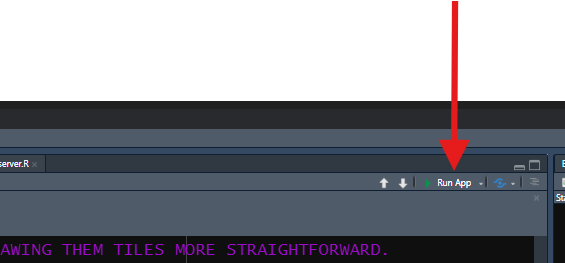

::: objectives
-   Build the files and folders needed to house a Shiny app and name
    them according to Shiny's conventions.
-   Value the convenience afforded by a `global.R` file.
-   Link a **stylesheet** to your app.
-   Structure your app's UI in its `ui.R` file by nesting (Shiny) HTML
    boxes, as you might more or less do using HTML code.
-   Use your browser's **developer tools** to examine and troubleshoot
    your app's HTML and CSS.
:::

::: questions
-   How should I start building a Shiny app?
-   What code's required to get a Shiny app to start?
-   What goes in my `server.R` file? My `ui.R` file? My `global.R` file?
-   How do I design an app that'll look nice on any device?
:::

### Preface

In the next lesson, we'll start building a Shiny app together. In this
lesson, we'll tackle several important steps that'll set us up for
success in that endeavor.

### (Detour: Installing packages)

In this lesson, we'll begin to use some of R's **packages**. If you
haven't already, install those now:


``` r
##RUN THIS CODE IN YOUR CONSOLE PANE--**DON'T** INCLUDE IT INSIDE YOUR SHINY FILES. YOU ONLY NEED TO INSTALL PACKAGES **ONCE**.
install.packages(c("shiny", "dplyr", "ggplot2", "leaflet", "DT", "plotly", "gapminder", "sf"))
```

Of course, to access their features, we need to turn these packages on
too, but there are some other things we must do first.

## Establishing our Shiny app's Project Folder

It's useful to make a single folder (our "**root directory,**" or
**root** for short) to house all our app's files and then make that
folder an **R Project folder**. You don't need to know what all that
means if you don't already—just know it's valuable.

Here's how to do it:

1.  In RStudio, go to `File`, then select the second option,
    `New Project`.

2.  In the pop-up that appears, select the first option,
    `New Directory`.

3.  Next, we'll select the type of project we're creating. One of the
    options you'll be presented is `Shiny application`, *but don't pick
    that one*! Instead, select the *first* option, `New Project`.

4.  On the next screen, use the `Browse` button to find a location on
    your computer to place your project folder. Then, give the project a
    name, such as `shiny_workshop`, that befits your current project.

    -   There are other options on this screen that, if you're familiar
        with Git or `renv`, you might consider as well (both are
        recommended but outside the scope of these lessons).

5.  Once you're satisfied, click `Create Project`.

**Important**: Once you've created your Project, you should see a
`.Rproj` file appear inside that folder. From now on, to work on your
Shiny app, launch this file to start an RStudio session connected to
your Project. Doing so will save you time and energy!

## Creating the necessary files

I recommend building Shiny apps using the so-called **three-file
system**:

-   Go to `File`, select `New File`, then select `R Script`. Repeat this
    process two more times to create three **scripts** in total.

-   Then, give them these *exact* names (in all lowercase):

    -   `ui.R`

    -   `server.R`

    -   `global.R`

These files will hold our app's client side (**user interface**) code,
back-end (**server**) code, and setup code, respectively.

R Shiny will recognize these exact names as "special," so using them
enables handy features. One of these is that, in the top-right corner of
the Script Pane, you should see a "Run App" button with a green play
arrow whenever you are viewing any of these three files in the Script
Pane.



This button will allow you to start your app at any time to check it out
or test it (something you should do *constantly*, both during these
lessons and when developing your real apps!).

We need to start populating these three files with essential code, but
before we do, let's first create some more folders and files every R
Shiny project should have:

-   In the "Files, Plots, Packages, etc." Pane in your RStudio window,
    while viewing your Project Folder, click the `New Folder` button.
    Name it *exactly* `www`. R Shiny will automatically look inside a
    folder by this name in your root directory for many things,
    including media files (like images), custom font files, and CSS
    files referenced by your app.

    -   Speaking of which: Click `File`, `New File`, then `CSS file`.
        Give this new file the name `styles.css` and save it in your
        `www` folder. We'll put custom CSS code in this file to style
        our app's aesthetics.

::: callout
If you plan to build complex Shiny apps, you *may* also want to create a
file for custom JavaScript code called `behaviors.js` and place this
file in `www` as well. We won't use such a file in these lessons, but
because there is more you can do using JS than R Shiny will easily do
for you, there are many instances where a *little* custom JS code can
*significantly* enhance your app's behaviors, and having a specific file
in which to put that code is tidy.

For complex apps, I'd also recommend a folder inside your Project folder
called `inputs`. Use this folder to store input files your app needs to
start up, like data sets, that *aren't* media like pictures or fonts. We
won't use such a sub-folder in these lessons, but, for real projects, it
useful to have such a folder to stay organized.

Similarly, I'd recommend a third new folder inside your Project folder
called `Rcode`. As an app's code base gets larger, you may want to
divide your app's code into smaller, more manageable chunks (such as by
building custom functions to perform repeated tasks or by dividing your
app's code into "modules"). At that stage, you can place R files for
each chunk in this folder, then source those files in your `global.R`
file. We won't use any such sub-folder, but I use one for all my apps.
:::

We now have all the files and folders we'll need, so let's work on
getting our app to where it'll actually start up.

### Starting our global.R file

We'll start with `global.R`. R will run this file *first* when booting
your app, so it's job is to load and/or build everything needed to
enable the rest of the app to boot successfully.

When your app gets large and complex, this file will hold many different
things. To start, though, at a minimum, it'll likely contain two: 1)
`library()` calls to load required add-on packages and 2) `read*()`
calls to load required data sets:


``` r
##Place this code in your global.R file!

### LOAD PACKAGES <--CREATE HEADERS IN YOUR FILES TO KEEP LIKE CODE TOGETHER AND TO STAY ORGANIZED!
library(shiny)
library(dplyr)
library(ggplot2)
library(plotly)
library(DT)
library(leaflet)
library(gapminder)
library(sf)

### LOAD DATA SETS 
gap = gapminder
```

By having a `global.R` file, we can place things like `library()` calls
and code for loading data sets in a single place for the entire app.
Without it, we'd need to place these commands inside *every* app file in
which they are needed—what a pain!

## Starting our server.R file

Setting up `server.R` is *relatively* easy because there's only one
block of code needed there to start:


``` r
##Place this code in your server.R file!

server = function(input, output, session) {
  
  #ALL OUR EVENTUAL SERVER-SIDE CODE WILL GO INSIDE HERE.
  
}
```

**Notice:** `server.R` will hold just one **object**: a **function**
called *exactly* `server`. This function will have three **parameters**
called *exactly* `input`, `output`, and `session`. R Shiny will look for
the function by this name when it starts an app, and it'll create
objects called `input`, `output`, and `session` to feed to that function
as inputs during the start-up process. Using these *exact* names is
*mandatory*!

It makes sense, if you think about it, that our app's server file
creates a **function** (a verb) because it's the "half" of the app that
*does stuff*. By contrast, the **UI** of our app mostly *"sits there and
looks pretty"* for the user, only changing in really profound ways when
directed by the server.

## Starting our ui.R file

Even less code is *needed* in `ui.R` to start with—we need to place just
a single HTML box into it, into which we'll eventually place all other
such boxes we'll build:


``` r
##Place this code in your ui.R file!

ui = fluidPage(
  
  #ALL OUR EVENTUAL CLIENT-SIDE CODE WILL GO INTO ONE OF THE TWO SECTIONS BELOW INSIDE OF THIS OUTERMOST SHINY HTML BOX.
  
  ### HEAD SECTION
  
  
  ### BODY SECTION
  
)
```

Here, we use an R Shiny HTML box called `fluidPage()` to create a
stretchy box that will hold the entirety of the webpage we'll build.
We'll soon fill this box with a bunch more boxes to give our app it's
ultimate structure.

However, first, let's link up our app's **stylesheet**, the `styles.css`
file we made earlier. Because the UI is the "visual" part of a website,
and because CSS controls a website's looks, it makes sense we'd load a
CSS file in `ui.R` instead of in `global.R` or somewhere else. It also
makes sense we'd put this linkage in our app's `head` HTML box because
it's instructions for a user's browser to consider, not something a user
themselves needs to see.

Here's how to do this:


``` r
##Place this code INSIDE your app's fluidPage container in the HEAD sub-section!
tags$head(
  
  tags$link(href = "styles.css", 
            rel = "stylesheet") 
), #<--YOU'LL NEED A COMMA TO SEPARATE EVERY NEW ELEMENT IN YOUR UI FROM THE PREVIOUS/NEXT ONE, SO YOU WILL SOON NEED A COMMA HERE, WHETHER YOU ADD IT NOW OR NOT.
```

Here, we've told the app there is a specific *stylesheet*, a CSS file,
by the name of `styles.css` we want a user's browser to use when
constructing our website. Note that we *link* to this file rather than
*load* it—that's an HTML thing!

*By default, the app will look for CSS stylesheets in the `www`
sub-folder*, so as long as that's where we put it, we don't need to
provide more details than this to the `href` parameter.

### Jumpstarting our UI

Now, we can add some additional boxes to our `fluidPage()` to start
giving our app structure. In this series of lessons, we'll *sort of*
practice a UI design approach called **mobile-first design**. This means
designing apps with mobile users in mind *first* and all other users
*second*.

The logic of this approach is that, if an app looks and feels good on a
narrow-screened, mouseless device, it should look and feel just as good,
if not better, on a wider, mouse-enabled device more or less
automatically. By contrast, ensuring that a website designed for a
computer also works well on mobile devices tends to be harder.

This approach means, among other things, placing our UI elements with
the assumption that they will need to adopt a "vertical" or "stacked"
layout for mobile users. Pretty much every major element will get to use
the screen's full available width if it needs to, and each subsequent
element will flow below rather than next to the previous one.

However, we'll also set up our UI such that, if a user *does* have a
wide enough screen, *some* things will arrange side by side *instead*. A
wider layout will tend to look less quirky on a wider screen than a
strictly vertical layout would because more content will fit on the
screen at once and the added spatial constraints will keep elements from
stretching too much horizontally.

So, with all that in mind, let's add the following boxes to our app's
UI:

1.  A **header**, built using `h1()`, with the `id` attribute of
    `"header"` (`h1`s are top-level headings in HTML).

2.  A **footer**, built using `div()`, with the `id` attribute of
    `"footer"`.

3.  In between, a `fluidRow()`.

    -   Inside it, we'll place two `column()`s, which will act as
        "cells" in this 1 row by 2 column "table."

The R Shiny function `column()` has a required input, `width`; all
`width` values of `column()`s inside a `fluidRow()` must be whole
numbers that sum to exactly 12. So, let's set the `width`s of these
columns to `4` and `8`, respectively. In practice, this'll make the
second column twice as wide as the first. As a result, the second column
will take up 2/3rds of the available screen width, creating the *feel*
of a left-hand "side panel" and a right-hand "main panel," a standard
layout found across the web.

However, as we've discussed, `fluidRow()`s are "smart"—on narrow
screens, elements in the same row will flow vertically if there isn't
enough room for them to fit side-by-side. This means that our "side
panel" will actually go *above* our main panel on a narrow screen
automatically (because it's specified *first*), which will be more
intuitive for users encountering our elements vertically:


``` r
##Place this code INSIDE your app's fluidPage container in the BODY section!

h1("Our amazing Shiny app!",
         id = "header"), #<--EVERY NEW UI ELEMENT IS SEPARATED FROM EVERY OTHER BY COMMAS.

fluidRow(
  ###SIDEBAR CELL
  column(width = 4),
  ###MAIN PANEL CELL
  column(width = 8)
),

div(id = "footer")
```

A couple more things to note about R Shiny boxes at this point:

1.  Most Shiny boxes have a `class` parameter and an `id` parameter,
    just like their HTML analogs. These two parameters are *always*
    *optional*, and their purpose is to be targets in CSS **selectors**.

2.  However, if a Shiny box has an `inputId` or `outputId` parameter
    (and we'll meet *many* that do!), those are *mandatory*; those serve
    Shiny-specific purposes (*in addition to* serving as CSS
    targets)—more on those attributes in the next lesson!

3.  Every Shiny UI element is separated from every other using commas,
    just like inputs inside a function call are. Forgetting these commas
    is a *very* common mistake for Shiny beginners!

4.  Because R Shiny UI code is *really* just thinly-veiled HTML code,
    writing it involves **nesting** a *lot* of function calls inside
    other calls. For many, this can be confusing! Keeping your code
    organized using comments to create sub-sections can help you keep
    things straight.

::: callout
Start up your app at this point by pressing the "Run App" button in the
upper-right corner of the Script Pane when viewing any of your `.R`
files.

I recommend using the drop-down menu on the side of the "Run App" button
to select the "Run External" option, which will cause your app to launch
in your default web browser instead of in RStudio's Viewer pane or in a
separate R window. In general, apps will perform better when run in a
web browser, so you will get a more actionable impression of how your
app is doing this way.
:::

::: discussion
What do you see when you start up your app? Explain why the app looks
the way it does so far.

::: solution
Besides our title we placed as contents inside our header, our app will
actually look completely empty!


This is because we have introduced several HTML boxes (a footer, a side
panel, a main panel, and a box holding the latter two), but we haven't
actually put anything in those boxes that isn't just other boxes!

That is to say that HTML boxes are empty until we provide them with
**contents** that *aren't* other boxes. That's what we will do in the
next lesson!
:::
:::

By most standards, our app also looks *very* basic—just a white screen
with a generic-looking title. This is because the default CSS applied to
Shiny apps is *very* basic, as I warned in the previous lesson! This is
why I argued that learning some CSS is essential to craft attractive
apps.

What about our CSS file we linked in, though? Sure, we've linked to our
CSS stylesheet, but we haven't actually put any code in it yet. Until we
do, Shiny's default, bland rules will be used.

::: challenge
Let's make our first style rules! Since there's nothing else to style
yet, though, let's style our title. In your `styles.css` file (which you
can open in RStudio), write a **rule** that will make the title of our
app *green* and *bold*.

The first **property** to set here is called `font-weight`, and the new
value for this property should be `bold`. I'll leave you to figure out
what the second property-value pairing should be! Run your app to make
sure your rule is working.

::: solution
Here's what our CSS rule should look like:

``` css
h1#header {
font-weight: bold;
color: green;
}
/* You could also have simply put #header in the selector, as no two HTML containers are allowed to have the same id anyhow! 
```

And this is what our app should look like once you apply the change:


:::
:::

If your app doesn't look like this, there are two things you should try:

-   Perform a hard refresh on your browser. In Edge, this can be done
    using Control + F5. This will refresh the page and clear your
    browser's cache for your app. This is sometimes necessary to clear
    out old CSS your browser may be using and apply new CSS.

-   Ensure that your CSS file is properly linked to your app (see
    earlier in this lesson).

If neither of these suggestions resolves your issue, read on to learn
about another tool you might be able to use to troubleshoot CSS issues
like this!

## Meeting the Developers Tools dashboard

In this lesson, we gave our header an `id`, which made it easier to
target it with a CSS **selector**. What happens if you want to target a
specific element of your app, but you *aren't* sure what selector to use
to do that?

Good question: Let's introduce you to every web developer's secret
weapon—your browser's **developers tools**.

Every browser has a slightly different way of launching its developers
tools. Personally, I use Microsoft Edge as my browser. To access
developers tools in Edge, right-click any element on any website and
select the last option in the resulting menu, `Inspect`.


[The workflow you might need to use for your browser of choice might be
different](https://jeffrey1183.gitbooks.io/intro-to-programming/content/front-end-development/what-is-javascript/4developer-tools-on-different-browsers.html).

Once you figure out how to open up your browser's developer tools,
you'll see that it's a frankly intimidating window showing, among other
things, the HTML of the website you're on (usually on the top or left)
and the CSS of the element you're inspecting (usually on the bottom or
right):


If I didn't know the right selector to use to target an element, I could
right-click on that element in the HTML (see picture above), go to
`Copy` in the resulting menu, and then select `Copy selector` from the
resulting sub-menu:


Doing this would put `#header` into your clipboard, in this case, which
could then be used in a CSS rule as a selector moving forward.

The CSS section of the developers tools will also list all the rules
that are currently affecting a given element, which properties are being
modified, and which new values are being set. If your CSS code isn't
working as intended, you can check here to ensure your code is being
recognized and applied correctly.

These are just two of the many ways that developer tools is a useful web
development tool. I won't mention it again in these lessons, but it's
*essential* you know how to access it!

::: keypoints
-   Use the three-file system to organize your app's code to benefit
    from several R Shiny features within RStudio.
-   A `global.R` file is handy for storing all the code needed to fuel
    your app's start-up and any other code your app needs that only
    needs to run once.
-   A CSS stylesheet holds CSS code for dictating your app's aesthetics.
    One can be linked to an app inside of `ui.R` using `tags$head()`.
-   UI elements get nested inside one another and must all be placed
    inside our UI object's outermost container (here, a `fluidPage()`).
-   Most UI elements can be given `id` and `class` attributes use in CSS
    selectors. UI elements must be separated from one another in the UI
    with commas.
-   `fluidRow()` and `column()` can be used to create a "grid," within
    which elements may arrange next to each other on wide screens but
    vertically on narrow screens, creating a responsive, mobile-first
    design with little fuss.
-   CSS styling requires using the right selector to target the right
    element(s). If you aren't sure of the right selector to use, you can
    retrieve it using your browser's developer tools.
:::
