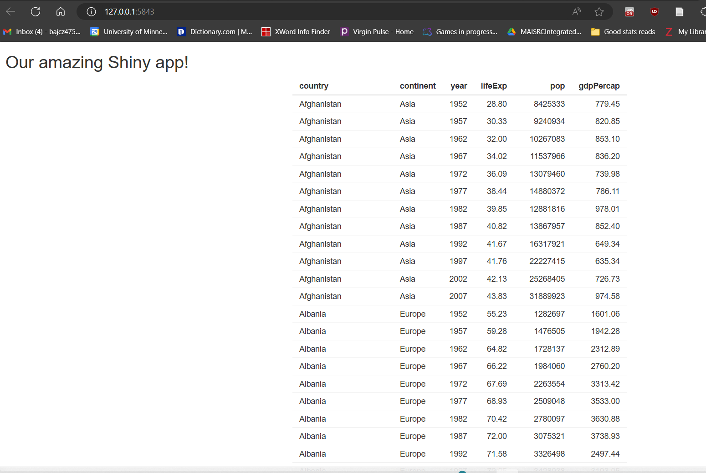

::: objectives
-   Build a table to display in our app's UI.
-   Allow our users to adjust how the table appears in real time.
-   Give the users greater control over when the table's appearance is
    adjusted.
-   Define the terms reactive context, event, handling, declarative
    coding, and imperative coding. Be able to relate them to coding in R
    Shiny.
-   Explain how and why R Shiny server-side code executes differently
    than traditional R code.
-   Use isolation and observers to achieve greater control over event
    handling.
-   Expand our UI's "real estate" by introducing a set of tabs.
:::

::: questions
-   How do I put cool stuff into my app?
-   How do I give my users meaningful things to do with my app?
-   How do I code my app to respond to my user's actions?
-   How do I give my user greater control over when/how my app responds
    to their actions?
-   How do I give myself greater control over when/how my app responds
    to user actions?
-   How is build R Shiny server code perhaps quite different than any
    coding I've done before?
:::

### Going from nothing to something

As we saw at the end of the previous lesson, if you start your app now,
it won't look like much—just a title on an otherwise empty page. In this
lesson, we'll fix that! As we add content, we'll learn three core
concepts: 1) **rendering** and **outputting** UI elements, 2) **input
widgets**, and 3) **reactivity**.

We're going to create an app showcasing the `gapminder` data set, which
contains population, life expectancy, and economic data over time for
most countries. The goal will be to give users several interesting ways
to interactively engage with those data.

Let's start by giving them a table with which to view the data. Given
that a table is just several boxes (cells) within larger boxes (rows and
columns), it makes sense that a table structure can be built using HTML,
although it can require a LOT of boxes!

Fortunately, we don't have to "draw" all those boxes "by hand;" we can
have R do it. To insert an element into our UI that is complex enough to
build that using a programming language like R to build it for us is
appealing, we must:

1.  Make (*i.e.*, *render*) that element on the server side of our app.

2.  Then pass it to the UI side, where it can be translated into
    (*i.e.*, *outputted as*) the equivalent HTML element(s).

For virtually every such complex element you'd want to build in R Shiny,
there is a pair of functions designed to do those two steps. In this
particular case, that pair with be `renderTable({})` on the server side
and `tableOutput()` on the UI side. [Notice that most Shiny functions
follow a camelCase **naming convention**.]

Let's use these two functions to add a basic table of the `gapminder`
data set to our app:


``` r
##Place this code INSIDE your app's server function INSIDE your server.R file! 

###TABLE
output$basic_table = renderTable({
  gap #<--OR WHATEVER YOU NAMED THIS OBJECT IN GLOBAL.R
})
```

In the code above, we instruct R to render an "HTML-ready" version of a
table containing the entire gapminder data set. If we wanted to do any
operations on this data set first (such as filtering it or adding
columns to it), we could have done those using "normal" R code inside
`renderTable({})`'s braces. So long as it's a table, the last thing
produced or referenced inside the braces is what will be passed over to
the UI. Here, we just want to pass over the raw data set, so that's all
we put inside the braces.

*How* this table is passed from the server to the UI, though, is worth
highlighting! In the previous lesson, recall that the app creates an
object called `output` as soon as the app starts running. The task of
passing rendered elements from the server side of the app to the client
side is what `output` is for. We just need to give the element a
nickname (an `outputId`) and stick the element to the `output` object
using that nickname plus the `$` operator, and the app will do the
"passing" for us! Here, the nickname I provided was `basic_table`.

The only other thing the app needs to know now is *where* it should put
this rendered table in the app's UI. We can tell it that using our
placement of the `tableOutput()` call in our UI code:


``` r
##This code should **replace** the "main" fluidRow() contained within the BODY section of your ui.R file!

##... other UI code...

fluidRow(
  column(width = 4),
  column(width = 8,
         tableOutput("basic_table")#<--PUTTING OUR RENDERED TABLE INTO OUR "MAIN PANEL" CELL.
         )
),

##... other UI code...
```

Here, we've placed our outputted table inside the "main panel" of our
central, two-column `fluidRow()`.

As you can imagine, we could want to display multiple tables in a single
app. How would the app know *which* table should be displayed *where*?
Well, `tableOutput()` takes, as its first input, the `outputId` of the
table that should be displayed in that location, so we can use the
`outputId`s we pick when writing our server code to keep our outputs
straight in our UI code.

If you run your app at this point, you should get something that looks
like this:



Which is cool! But also not *terribly* exciting...it looks a little
drab, and users can't actually **do** anything with this table except
look at it. The first problem we'll fix later by swapping this table out
for a much better one. However, we can fix the second problem now.

### Giving your users input

The value of Shiny apps is often measured by much they let users *do*.
To enable meaningful user interactions, we need to add **widgets** to
our app. A widget is any element a user can interact with in such a way
that the app might be coded to respond to. In web development, a user
action that a webpage can watch for is called an **event**; responding
to an event (or choosing not to respond!) is called **handling** it.

We're going to give our users a way to interact meaningfully with our
table by adding an **input widget** to our UI. Then, we're going to tell
our app how to **handle** any user interactions with that widget by
adding some *reactive* code to our `server.R` file.

Let's start by adding the input widget: We'll add a `selectInput()` call
to our "sidebar" container in our UI. This call will produce a
"drop-down menu" style element that will allow users to select a single
choice from a pre-defined list. Specifically, we'll fill that list with
the names of the columns in our `gapminder` data set:


``` r
##This code should **replace** the "main" fluidRow() contained within the BODY section of your ui.R file!

##... other UI code...

###SIDEBAR CELL
    column(
      width = 4,
      ##ADDING A DROP-DOWN MENU WIDGET TO THE SIDEBAR.
      selectInput(
        inputId = "sorted_column",
        label = "Select a column to sort the table by.",
        choices = names(gap) #<--OR WHATEVER YOU NAMED THIS OBJECT IN GLOBAL.R
      )
    )
  
##... other UI code...
```

Notice that we had to provide `selectInput()` with three inputs:

1.  An `inputId` is both an `id` for the purposes of CSS and a nickname
    the app will use for this widget server-side. We'll see how that
    works in a minute.

2.  The text we provide to `label` will be the text that accompanies the
    widget in the UI and, usually, explains to the user what the widget
    does (if it isn't obvious).

3.  For `choices`, we provide a vector of values that will be the
    options that appear in our drop-down menu and that users can choose
    from.

While there are a few variations on this theme, most R Shiny input
widgets work a lot like `selectInput()`, so it's a good first example.

Now, our app should look like this:


Very nice!

...Except for two things. First, the choices in the drop-down menu are a
little...ugly. They look *exactly* like the names of the columns in our
data set, which are not very human readable in the sense that they are
abbreviations that lack spaces between words and also lack capital
letters.

How could we fix this? Well, we *could* rename the columns in the data
set, but while column names in R *can* contain spaces, at best, it's
hard to make that work. Plus, longer and more complex names require more
typing.

Instead, we can provide a **named vector** to `choices`. The names we
give (those to the left of the `=` operator) will be what gets displayed
in the drop-down menu, whereas the original column names (those to the
right of the `=`) will be what the server side of our app works with:


``` r
##This code should **replace** the "main" fluidRow() contained within the BODY section of your ui.R file!

##... other UI code...

###SIDEBAR CELL
    column(
      width = 4,
      selectInput(
        inputId = "sorted_column",
        label = "Select a column to sort the table by.",
        choices = c(
          #BY USING A NAMED VECTOR, WE CAN HAVE HUMAN-READABLE CHOICES AND COMPUTER-READABLE VALUES. TYPE CAREFULLY HERE!
          "Country" = "country",
          "Continent" = "continent",
          "Year" = "year",
          "Life expectancy" = "lifeExp",
          "Population size" = "pop",
          "GDP per capita" = "gdpPercap"
        )
      )
    )
  
##... other UI code...
```

With that change made, our drop-down menu widget should be looking much
better! Except it doesn't actually *do* anything...yet. We've created
something a user can interact with, triggering **events**, but we
haven't told the app how to **handle** those events yet.

### R'll handle that

Let's do that next. We'll give the user the ability to sort the table by
the column they've selected by using the `dplyr` verb `arrange()`. You
might be surprised to learn that this is actually quite straightforward
in this particular case:


``` r
##This code should **replace** the renderTable({}) call contained within your server.R file!

###BASIC GAPMINDER TABLE
output$basic_table = renderTable({
  
  gap %>% 
    #USE dplyr's arrange() VERB FOR SORTING ACCORDING TO THE PICKED COLUMN.
    arrange(!!sym(input$sorted_column)) #!! (PRONOUNCED "BANG-BANG") AND sym() ARE OBSCURE R TRICKS, NOT R SHINY THINGS. LET'S NOT WORRY ABOUT WHAT THEY DO.
})
```

##This code should \*\*replace\*\* the renderTable({}) call contained
within your server.R file!

Earlier, we met the `output` object, which exists to pass rendered
entities from the server to the UI where they can be seen by the user.
Here, we meet the `input` object, which exists to pass user inputs from
the UI to the server where they can be responded to.

In this instance, `input` is passing (*all the time forever!*) the
**current** value of the widget with the `inputId` `sorted_column`
(that's the nickname I gave our drop-down menu when I created it) over
to the server. Our server code can then use that value to influence how
it builds our table, such as how it sorts it.

But it's fancier than that! R Shiny knows that, *at any moment*,
`input$sorted_column`'s value could *change*. Objects with
user-changeable values are called **reactive objects**—at any moment,
they might change *in reaction to* what a user is doing.

So, because we've used `input$sorted_column` in some of our server code,
and because R knows that `input$sorted_column`'s value could change at
any time, it knows to be *watching* for such changes.

Whenever it sees one, it runs whatever code involves
`input$sorted_column` *again*. The logic of this makes sense, when you
think about it: If `input$sorted_column` has changed, anything that used
its *previous* value may now be "outdated," so it'd be good to *re-run*
*all* the associated code and produce more current outputs!

Run the app and try it out. As you select different columns using the
drop-down menu, the table *automatically* rebuilds, sorted by the column
you've picked most recently. Because the code inside `renderTable({})`
contains `input$sorted_column`, all that code reruns every time
`input$sorted_column` changes, which happens every time the user selects
a new column from the drop-down menu. We're successfully *handling* the
*events* triggered by our user's interactions with our input widget!

### Reactivity

There is just one small and technical but important detail: Our server
code *can't* watch for changes in the values of **reactive objects**
just anywhere—it can *only* do so within so-called **reactive
contexts**.

A reactive context is a code block that R *knows* it needs to watch and
might need to run over and over (or never!). It makes sense that we can
only put changeable objects inside code blocks that R knows it needs to
be watching for such changes!

::: challenge
**Try it:** Pause here to prove the previous point. Copy
`input$sorted_column` and paste it anywhere *inside* your server
function but *outside* of `renderTable({})`. Then, try running your app.
It should **immediately** crash! Notice the R error in your R Console
when this happens and rephrase it in your own words.

::: solution
You'll get an error that looks a lot like this:\
\
Error in \$: Can't access reactive value 'sorted_column' outside of
reactive consumer. ℹ Do you need to wrap inside reactive() or observe()?

This error notes that `input$sorted_column` is a **reactive object** (to
be technical, a sub-type called a reactive value) and that you've tried
to reference it outside of a reactive context, where R would actually be
"prepared" to watch it.
:::
:::

How can we recognize a reactive context so we know where we can and
can't put entities like `input$sorted_column`?

*Generally speaking*, when an R Shiny server-side function takes, as an
input, an *expression* bounded by curly braces ( `{}` ), everything
inside those curly braces becomes a reactive context.

Maybe you've noticed the curly braces in `renderTable({})` and wondered
what they're for. *The main input to every `render*()` function is an
**expression** for creating a **reactive context**!*

That means R *assumes* that every complex element we render in our
server might need to be *re-rendered* because the user changed or did
something. We provided `renderTable({})` with a set of instructions that
included what to do to *handle* changing values of `input$sorted_column`
and `renderTable({})` handles (literally) the rest.

### How R Shiny differs from "normal R"

You're hopefully realizing how coding in R Shiny is different from
coding in "normal R" in some key ways.

For many regular R users, the "nestedness" of the code in a UI file
probably feels pretty foreign (it should—we're basically writing HTML
code there!).

Meanwhile, on the server side, having to imagine and design ways a user
might interact with our app and then coding instructions for how the app
should respond, no matter when or under what circumstances, is probably
also foreign-feeling.

It should—R Shiny server code is *not* like normal R code! In fact, it's
an entirely different *paradigm* of programming.

Normal R code is generally executed **imperatively**. That is, it is run
from the first command to the last as fast as possible as soon as we
(the user) hit "run."

Server-side Shiny code, meanwhile, is generally executed
**declaratively**. That is, it generally runs once when the app starts
up (or not), but, after that, it never runs again *unless* and *until*
it is *triggered* to run by one or more specific **events**. [This is
true when R is deciding which reactive contexts to run when; however,
the normal R code *within* those contexts will still run imperatively,
once that reactive context begins running.]

These two different paradigms can be understood better via an analogy:
Imagine you are in a sandwich shop ordering a sandwich. You probably
expect that the employees of the shop will begin making your sandwich as
soon after you place your order as possible, using instructions and
supplies their manager gave them.

In that analogy, the relationship between you and the shop is
**imperative**; you aive a "command" and the sandwich shop "executed"
that command as quickly as it could manage via a pre-defined set of
steps.

Meanwhile, the relationship between the manager and their employees is
**declarative**. The manager can't know which customers will come on a
given day, when they will show up, or which sandwiches each will want.
So, they can't give their employees precise "commands."

Instead, they have to tell them to "watch for customers" and, when those
customers arrive and place orders (most, if not all, of which are
predictable ahead of time!), they should use a generalized set of
instructions to handle whatever orders have been placed.

As web developers, our relationship with our users is similar. We can't
know who will show up when and what exactly they might decide to do.
However, we *can* anticipate common actions they might take, give them
desirable actions to take, and give the app detailed but generalized
enough instructions that it can take care of all those different
requests whenever (or if ever) they occur.

::: discussion
Check for understanding: How does the code we've written so far in our
`server.R` file execute differently than code we'd write in a
traditional R script? How does the code inside of `renderTable({})`'s
braces differ from traditional R code we might write?

::: solution
Server-side R code is often broken up into many reactive contexts, each
tasked with generating one or more complex UI elements and/or handling
user actions. Unlike traditional R code, much of this server-side code
runs when a user performs a triggering action, not when an operator hits
"enter," so to speak.

Plus, server-side code is not always run from top to bottom; reactive
contexts will (re)-run based on user actions, not on placement within
the file. Plus, reactive contexts may be trigger to rerun multiple
times, or never, depending upon what actions a user does or does not
take.

Inside a reactive context, things are more traditional in that the code
inside a reactive context will run just once, from top to bottom, as
quickly as possible as soon as that context is triggered to (re)run.
However, these contexts may contain reactive objects (like `input`
sub-objects), and it's changes in the values of these objects that might
cause reactive contexts to need to rerun to produce more current
outputs.
:::
:::

### Buttoning this up

By this point, R now knows that:

1.  Users might select new columns in our input widget (**events**),

2.  It should watch out for any such events, and

3.  If any occur, it should execute the `renderTable({})` code again,
    which will re-generate the table in a way we've instructed given
    whatever the user has selected.

In this specific circumstance (a simple table regulated by users through
just one input widget), this setup is *probably* fine. However, imagine
users had several inputs widgets instead of just one. If we used this
same approach to handle events based on those inputs, changing any one
of the inputs would trigger the table-rendering code to rerun and the
table would be remade.

That may be an undesirable level of reactivity, for several reasons.
Users often expect to have some say in when exactly an app changes
states. Maybe they expect to be able to experiment with the inputs to
find the combination of selections they are most interested in *before*
the app responds. Maybe the table loads slowly, and the user would
rather not have to wait through the rebuilding process unless they're
ready. Maybe they just want to be "in control" because they'd find
updating distracting when it doesn't happen on *their* terms.

Whatever the reason, we can easily give our users greater control over
our table by adding another input widget: an `actionButton()`.


``` r
##This code should **replace** the "sidebar" content of our fluidRow() contained within the BODY section of your ui.R file!

##... other UI code...

###SIDEBAR CELL
    column(
      width = 4,
      selectInput(
        inputId = "sorted_column",
        label = "Select a column to sort the table by.",
        choices = c(
          "Country" = "country",
          "Continent" = "continent",
          "Year" = "year",
          "Life expectancy" = "lifeExp",
          "Population size" = "pop",
          "GDP per capita" = "gdpPercap"
        )
      ),
      ##ADD AN actionButton(). PAY CLOSE ATTENTION TO CHANGES IN COMMAS/PARENTHESES IN THIS REGION!
      actionButton(inputId = "go_button", label = "Go!")
    )
  
##... other UI code...
```

This will add a simple, button-style input widget to our app's sidebar.
It will say `Go!` on it (`label`), and it's current value (which is a
number equal to the number of times it has been pressed, or `NULL` if it
hasn't been pressed yet) will be passed from the UI to the server at all
times via `input$go_button`.

Now, we need to tell R how to **handle** it when a user presses our
button (until then, pressing it won't do anything!). In this case, we
want the table to update *only* whenever the button is pressed (*i.e.*,
whenever `input$go_button` changes.

Here's where we hit a little snag: `renderTable({})`'s reactive context
is "indiscriminate;" *any* change in *any* reactive object it contains
will trigger ithe reactive context to rerun. So, simply adding
`input$go_button` to that reactive context will *not* prevent changes in
`input$sorted_column` from triggering a rerun. And we can't just remove
`input$sorted_column` from the reactive context because, then, we
couldn't use its value to decide how to sort the column when we do
remake the table. We're stuck!

Thankfully, Shiny has a function for sticky situations like these:
`isolate()`. Wrapping any reactive object in `isolate()` allows R to use
its current value to do work but prevents R from watching that object
for changes.

So, we can implement our new table-rendering approach like this:


``` r
##This code should **replace** the renderTable({}) call contained within your server.R file!

output$basic_table = renderTable({
  
  #BY PLACING input$go_button IN THIS EXPRESSION (EVEN IF WE DON'T USE IT TO DO ANYTHING!), WE MAKE THIS EXPRESSION A REACTIVE CONTEXT. IF IT CHANGES, THIS EXPRESSION WILL RE-RUN. 
  input$go_button
  
  #USING isolate() PREVENTS input$sorted_column FROM BEING REACTIVE (CHANGES TO IT WON'T BE HANDLED) BUT STILL ALLOWS US TO USE ITS CURRENT VALUE.
  gap %>% 
    arrange(!!sym(isolate(input$sorted_column))) 
  
})
```

Now, when users fiddle with our drop-down menu, nothing happens to the
table...*until* we press the button. At that point, iIf our selection in
our drop-down menu has changed since the last time the button was
pressed, the table will re-render.

### Being observant

This approach *works*, but it can get a little unwieldy if you have
*many* inputs that would need isolating. For situations like those,
where you would want the app to respond a certain way *only* when a
*specific* reactive object changes, especially when that response needs
to involve a bunch of other reactive objects you *don't* want being
watched, we can make our event handling considerably more precise using
`observeEvent({},{})`:


``` r
##This code should be **added to** your server.R file, after all other code but inside of your server function!

#observeEvent({},{}) TAKES TWO EXPRESSIONS AS INPUTS. IT WATCHES THE FIRST AND, WHEN IT CHANGES, IT RESPONDS BY RE-RUNNING THE SECOND. 
#SO, THE FIRST IS REACTIVE, BUT THE SECOND IS NOT. 
observeEvent(input$go_button, { 
  
  output$basic_table = renderTable({
    
    #WE DON'T NEED isolate() ANY MORE--THIS SECOND EXPRESSION IS NOT REACTIVE, SO CHANGES TO input$sorted_column WILL NOT TRIGGER THIS CODE BLOCK TO RUN.
  gap %>% 
    arrange(!!sym(input$sorted_column)) 
  })
  
})
```

Notice that I'm writing `observeEvent({},{})` using *two* sets of
braces. That's because we give it, as inputs, *two* expressions.
However, interestingly, these have a specific relationship:

1.  R *watches* *only* the *first* of these expressions for changes
    (it's the only **reactive** **expression**).

2.  R will only ever actually *execute* the *second* of these
    expressions, and *only* in response to changes in the *first*
    expression (changes to `input$sorted_column` *aren't* being watched
    because it's in the second expression, not the first). It's as if
    the *entire* second expression is wrapped in `isolate()`!

So, `observeEvent({},{})` is the equivalent of telling R "if *exactly*
[first expression] changes, do *exactly* [second expression]," which is
often the level of precision we'll want when handling events in a Shiny
app! It's for this reason that I use `observeEvent({},{}`s in large
volumes in my own apps.

### Totally tabular

We now have all the conceptual tools we need to build a cool app! In the
last lesson, we'll replace this table will a cooler one, and we'll add a
map and graph. To keep all this organized, though, let's add **tabs** to
our main content area, one for each of these features.

We can do this using the R Shiny functions `tabsetPanel()`, which is the
container that holds all the tabs, and `tabPanel()`, which holds the
contents of a single tab:


``` r
##This code should **replace** the "main panel" content of our fluidRow() contained within the BODY section of your ui.R file!

##... other UI code...

###MAIN PANEL CELL
##NEST YOUR UI ELEMENTS HERE **CAREFULLY**!
    column(width = 8, tabsetPanel(
      ###TABLE TAB
      tabPanel(title = "Table", 
               tableOutput("basic_table")),
      ###MAP TAB
      tabPanel(title = "Map",
      ###GRAPH TAB
      tabPanel(
        title = "Graph",
      )
    ))
   )

##... other UI code...
```

Now, if we look at our app, we'll see that we have three tabs in our
main panel area with the `title`s we specified in our code. We can swap
between the tabs using each tab panel's tab (yes, that is awkward to
say!) at the top, just like in a browser. The second and third tab
panels are empty for now, but we'll soon fix that!

::: keypoints
-   Complex UI elements, like tables and graphs, will first need to be
    rendered in our server code and then placed within our UI's
    structure using an `*Output()` function of some kind.
-   Rendered entities that are ready for display are passed from the
    server to the UI via the `output` object and the `outputId`'s we
    give these objects when we render them.
-   Input widgets are UI elements that allow users to interact with our
    app. The current values of these widgets are being constantly passed
    from the UI to the server via the `input` object and the `inputId`'s
    we give these widgets when we create them.
-   R knows to be watching reactive objects like those attached to
    `input` for changes. Any such changes are called events. Event
    handling is the process by which specific responses are coded to
    specific events.
-   The primary way R Shiny handles events is by re-running any reactive
    contexts that contain the reactive object that has changed, unless
    that object is wrapped in `isolate()`.
-   In our server code, reactive contexts are triggered to run
    directively (in response to user actions), not imperatively
    (triggered to run by a coder hitting "run"). They might run in any
    order, or never, depending upon what a user does. However, once a
    reactive context begins running, it's contents are run imperatively
    through to completion (even if they take a long time!), during which
    time the app will be unresponsive.
-   Observers (like `observeEvent({},{})`) build additional reactive
    constructs within which we can handle events. In particular,
    `observeEvent({},{})` allows for very precise event-handling in that
    only changes to reactive objects provided to its first expression
    trigger only the second expression to re-run.
-   `tabPanel()` and `tabsetPanel()` allow you to create a "tabular
    layout," allowing you to divide up one space in your UI into
    several, only one of which can be seen at one time.
:::
